# Link management portal — user guide

This guide explains how to use the link management portal of the GS1 Digital Link Resolver CE —
Expansion Pack, task by task. It is written for the people who register products, places, documents and
other identified items, and for the administrators who manage their accounts. No technical knowledge is
needed. The portal is available in Brazilian Portuguese and British English; the screenshots show the
English version.

For installation and operation see the [README](../README.md); for how the portal works inside see the
[developer guide](developer-guide.md).

*Versão em português: [guia do portal](pt-BR/guia-do-portal.md).*

## Contents

1. [What the portal does](#1-what-the-portal-does)
2. [Roles: what each user can do](#2-roles-what-each-user-can-do)
3. [Signing in, language and password](#3-signing-in-language-and-password)
4. [The editor at a glance](#4-the-editor-at-a-glance)
5. [Creating or changing a record](#5-creating-or-changing-a-record)
6. [Other records of the same identifier](#6-other-records-of-the-same-identifier)
7. [Deleting a record](#7-deleting-a-record)
8. [History of a record](#8-history-of-a-record)
9. [The QR code label](#9-the-qr-code-label)
10. [Data attributes in the QR code](#10-data-attributes-in-the-qr-code)
11. [Registered records: searching and filtering](#11-registered-records-searching-and-filtering)
12. [Spreadsheets: export and import](#12-spreadsheets-export-and-import)
13. [Checking that the targets answer](#13-checking-that-the-targets-answer)
14. [Administration: users](#14-administration-users)
15. [Administration: audit trail](#15-administration-audit-trail)
16. [Messages and what to do](#16-messages-and-what-to-do)
17. [Glossary](#17-glossary)

---

## 1. What the portal does

A **GS1 Digital Link** is a web address that carries a GS1 identification key, for example
`https://id.example.org/01/09506000134352/10/L2026A` for the product with GTIN 09506000134352, batch
L2026A. Printed as a QR code, it takes whoever scans it to a web page. The **resolver** is the service at
that address: it looks the identifier up and sends the person on to the page registered for it.

The portal is where those pages are registered. For each identified item you keep a **record** with:

- the **identifier**: a primary identification key (GTIN, GLN, SSCC, …) and, optionally, **qualifiers**
  that narrow it (variant, batch/lot, serial number, …);
- a **description** (the name of the product, place or document);
- one or more **targets**: web pages or documents, each of a **link type** (product information,
  instructions, safety information…) and a **language**. One of them is the **default target**, the one
  that opens when someone simply scans the code.

Changing a target takes effect immediately for every code already printed: packaging never needs to be
reprinted to change where the code leads.

The portal also produces the QR code label of each record, lists every record, imports and exports them
as spreadsheets, checks that the targets answer, and keeps the history of every change.

## 2. Roles: what each user can do

Each user has one role. An administrator chooses it (section 14).

| Action | Reader | Editor | Administrator |
|---|:-:|:-:|:-:|
| Open records, see their targets, labels and history | ✓ | ✓ | ✓ |
| Download QR code labels (PNG, SVG) | ✓ | ✓ | ✓ |
| See and search the record list; export spreadsheets | ✓ | ✓ | ✓ |
| Create, change, delete and restore records | | ✓ | ✓ |
| Import spreadsheets; check links | | ✓ | ✓ |
| Manage users; see the audit trail | | | ✓ |

A user may also be limited to one or more **GS1 Company Prefixes**: they then see and change only the
identifiers that belong to those prefixes, in every screen, spreadsheet and report. Without prefixes a
user works with every identifier on the resolver.

Readers see the editor with every field read-only and the note *Your role is read-only: you can consult
and export, but not change.*

## 3. Signing in, language and password

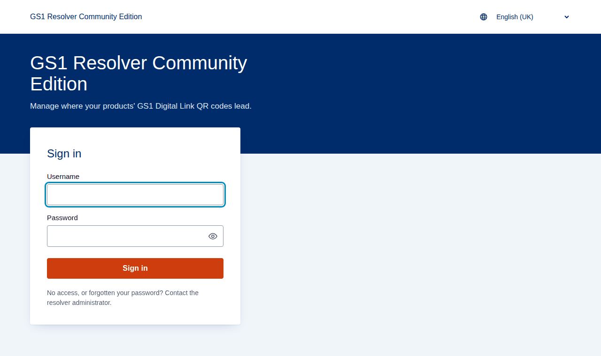

Open the portal address (for example `https://id.example.org/portal/`), enter your **Username** and
**Password** and select **Sign in**. If you have no account or have forgotten your password, ask the
resolver administrator: the portal has no self-service password reset.

- **Temporary password.** A new account, or one whose password an administrator has reset, starts with a
  temporary password. After signing in the portal asks you to set your own password before going on.
- **Show the password.** The eye button inside a password field shows what you typed; it hides again when
  the form is sent.
- **Too many attempts.** After 5 wrong passwords the account (and the computer they came from) waits
  15 minutes before trying again.
- **Session.** You stay signed in for 8 hours after your last action (the administrator can change this).
  When the session ends the portal asks you to sign in again.
- **Language.** The language menu at the top right switches between Português (Brasil) and English (UK)
  at once, without losing what you typed. The portal starts in the language of your browser and
  remembers your choice; the resolver's own pages and the home page follow the same choice.

### The user menu

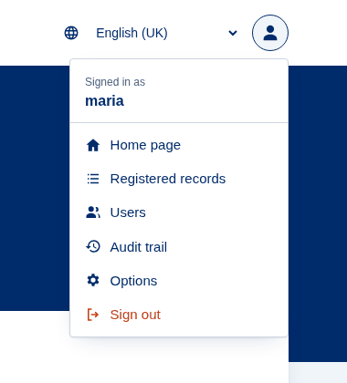

The round button at the top right opens the user menu: your user name, **Home page** (the resolver's
home page), **Registered records** (section 11), **Users** and **Audit trail** (administrators only),
**Options** and **Sign out**.

### Changing your password

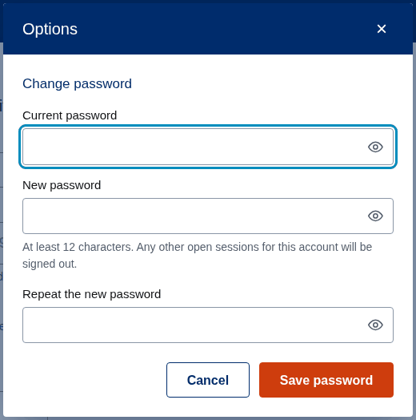

**Options** opens the password form. Enter the **Current password**, the **New password** (at least
12 characters) and **Repeat the new password**, then **Save password**. Every other session open with your
account (another browser, another computer) is signed out; the current one stays open.

## 4. The editor at a glance

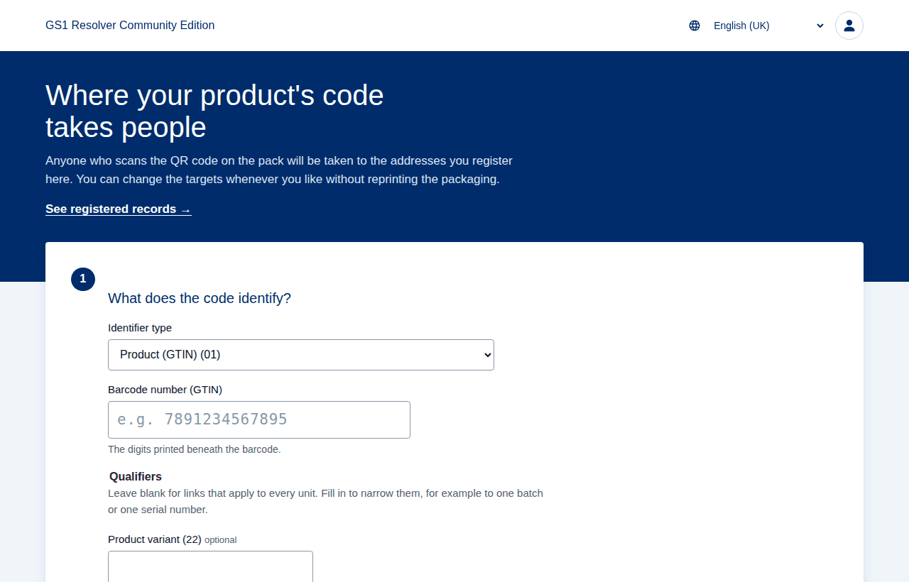

The page that opens after signing in is the **editor**. It has three numbered steps and, under them, the
**label block** with the QR code:

1. **What does the code identify?** — the identifier type, the identifier and its qualifiers, and the
   **Open record** button.
2. **Description** — what the item is called.
3. **Targets** — where the code leads.

The link under the page title, *See registered records →*, opens the record list.

## 5. Creating or changing a record

The same steps create a new record or change an existing one: the portal finds out which, when you open
the record.

### Step 1 — identify the item

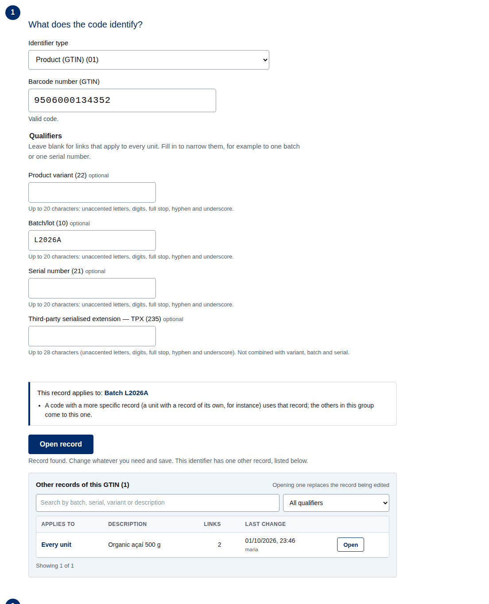

1. Choose the **Identifier type**. The list holds every primary identification key of GS1 Digital Link:
   Product (GTIN), Individual trade item piece (ITIP), Global Model Number (GMN), Component/Part
   Identifier (CPID), Physical location (GLN), Invoicing party (GLN), Party (GLN), Service provider and
   Service recipient (GSRN), Global Coupon Number (GCN), Logistic unit (SSCC), Document (GDTI),
   Consignment (GINC), Shipment (GSIN), Returnable asset (GRAI) and Individual asset (GIAI).
2. Type the identifier. For a GTIN, type the digits printed beneath the barcode: 8, 12, 13 or 14 digits;
   spaces, full stops and hyphens are ignored and the portal completes the GTIN to 14 digits. The message
   under the field checks it as you type — the length, the check digit (and which one it should be), the
   allowed characters, the GS1 Company Prefix at the start.
3. **Qualifiers** (only for the types that have them). Leave them blank for a record that applies to
   every unit of the item. Fill them in to narrow the record, for example to one batch or one serial
   number. Each field explains its format under it. The portal accepts only the combinations the
   standard allows and says why when it refuses one:

   | Identifier | Qualifiers |
   |---|---|
   | GTIN (01) | Product variant (22), Batch/lot (10), Serial number (21) — any of them, in this order (with a serial number, variant and batch are informative, see below); or Third-party serialised extension — TPX (235) alone |
   | ITIP (8006) | Batch/lot (10), Serial number (21) (with a serial number, the batch is informative) |
   | CPID (8010) | Component serial number (8011) |
   | GLN (414) | GLN extension (254), or UIC with extension and importer index (7040) |
   | Invoicing party GLN (415) | Payment reference number (8020), required |
   | Party GLN (417), GIAI (8004) | UIC with extension and importer index (7040) |
   | GSRN (8017, 8018) | Service relation instance number (8019) |
   | GMN, GCN, SSCC, GDTI, GINC, GSIN, GRAI | none |

   **A serial number with its batch or variant.** Type everything printed on the package: variant, batch
   and serial number. With a serial number, the variant and batch fields are marked *informative* and get a
   dashed border. The GS1 standard (GS1-Conformant Resolver, section 2.5.9) does not let a serial-number
   record depend on its batch or variant, so the record applies to the serial number; the batch and
   variant are kept with it — you can search, filter and export by them — and printed in the QR code.
   Someone who scans another unit of that batch without a record of its own goes to the batch's record,
   if there is one, and then to the product's.

   Under the qualifiers, the card **This record applies to** says it in plain words, for every
   combination: *every unit of this GTIN*, *Batch L1*, *Serial S1*…

   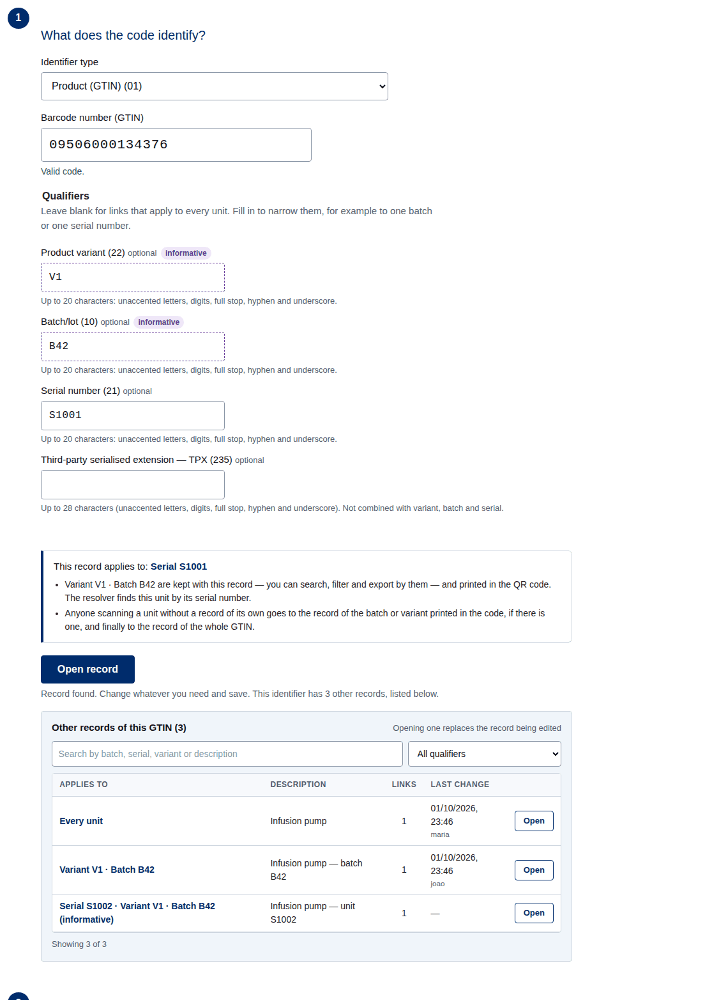

4. Select **Open record**. The portal asks the resolver and answers:
   - *Record found. Change whatever you need and save.* — the record exists; steps 2 and 3 show what is
     registered;
   - *No record yet. Complete the steps below.* — a new record;
   - when the identifier has other records (the product and some batches, for instance), it says so and
     lists them under the button (section 6).

If you change the identifier or a qualifier after opening a record, steps 2 and 3 are locked and the
portal asks you to select **Open record** again, so that you never overwrite another record by mistake.
If the record had changes you had not saved, **Open record** asks before discarding them. Changing only
the informative batch or variant of a serial number keeps the record open.

Opening a serial number without its batch or variant fills in the ones kept with it. If you type a
different batch, the portal keeps what you typed and points out the difference: saving replaces the
stored batch.

### Step 2 — description

Type what the item is called: *Disposable syringe 5 ml*, *Warehouse — dock 3*, *Invoice 2026-001*
(up to 200 characters). The description is shown in the record list and in the resolver's pages.

### Step 3 — targets

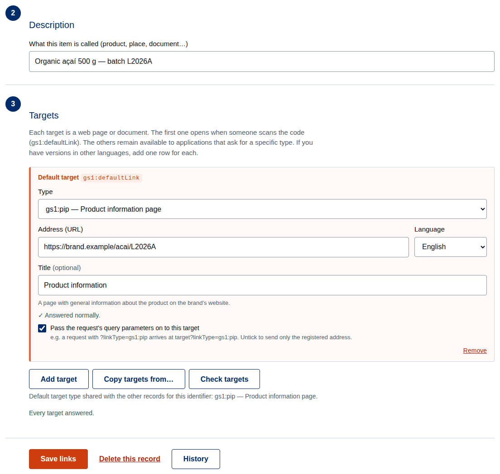

Each target is one web page or document. For each target fill in:

- **Type** — what the page is about, from the GS1 link types: Product information (`gs1:pip`),
  Instructions, Support, Safety information, Electronic patient information leaflet, Recall status,
  Nutritional information, Traceability, Master data (B2B) and others (29 in all). The text under the field explains the
  type chosen.
- **Language** — the language of the page (Portuguese, English, Spanish, French, German, Italian, Chinese,
  Japanese). Two targets of the same type are allowed only in different languages: the resolver then
  sends each person to the version in their browser's language.
- **Address (URL)** — the full address, starting with `https://`. Copy it from the browser's address bar;
  spaces, line breaks and invisible characters are refused.
- **Title** (optional) — a short name shown in lists of links.
- **Pass the request's query parameters on to this target** — ticked by default. When someone opens the
  code with extra parameters (`?linkType=…`, or data attributes such as an expiry date, section 10), the
  resolver adds them to this target's address. Untick it to always send exactly the registered address.

The first target is the **default target** (badge *Default target*, `gs1:defaultLink`): it opens when
someone scans the code without asking for anything in particular. **Make default** on another target
moves it to the top; **Remove** deletes a target; **Add target** adds one (up to 20 per record).

> **One default type per identifier.** All the records of the same identifier (the product, its
> batches, its serial numbers) share the same *type* of default target, because the resolver keeps it
> once per identifier. When other records exist, the portal shows that type and asks you to keep it first.

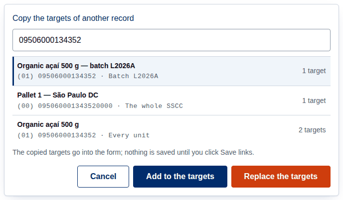

**Copy targets from…** opens a search over every record: choose one and **Add to the targets** (after
the ones in the form) or **Replace the targets**. Nothing is saved until you select **Save links**.

**Check targets** asks each address whether it answers (section 13); it never stops you from saving.

### Saving

Select **Save links**. The portal checks everything again on the server and answers:

- *Record created. The code now leads to the targets you entered.*
- *Changes saved. The code now leads to the new targets.*

**A record above it.** The GS1 standard asks that any code, however detailed, find a default target at
its level or above. When you save a batch, serial number or extension of an identifier that has no record
of its own, the portal asks first:

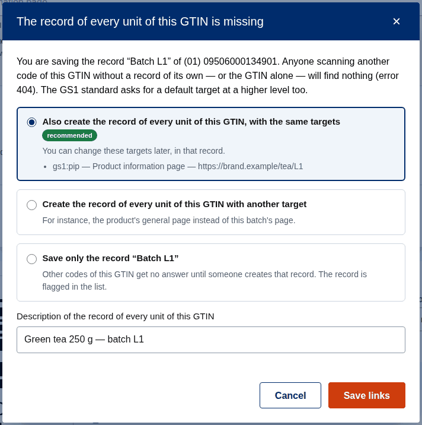

- **Also create the record of every unit of this GTIN, with the same targets** — *recommended*, and
  chosen already. You can change those targets later in that record;
- **Create it with another target** — for instance the product's general page instead of the batch's
  page; the type and language are those of your default target;
- **Save only this record** — the other batches and serial numbers of the identifier get no answer
  (error 404) until someone creates that record, and the record list flags it.

The description of the new record can be changed in the same window. **Cancel** saves nothing.
Identifiers that cannot exist without a qualifier (invoicing party GLN with its payment reference) are not
asked about.

After saving, the portal also checks that the targets answer and warns under any that does not
(section 13); the record is saved either way. If something is wrong, the message says what and where (for instance *Enter the address (URL) of target
2.*). The label block shows **Published** once the record exists on the resolver.

## 6. Other records of the same identifier

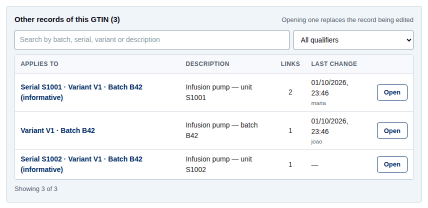

When the identifier has other records — the product itself, its batches, its serial numbers, its
variants — a box under **Open record** lists them: *Other records of this GTIN (3)*. For each one it shows
what it applies to (*Every unit*, *Batch L2026-03 · Serial S0001*), its description, number of links and
the last change made through the portal.

- Type in the search field to find a batch, serial, variant or description.
- Use the filter to show only the records with a given qualifier, or *No qualifiers (every unit)*.
- Five rows are in view at a time; scroll the list to see more.
- **Open** loads that record in the editor. If the record being edited has unsaved changes, the portal
  asks first: *This record has unsaved changes. Opening another one discards them. Continue?*

Records created elsewhere with qualifiers the portal cannot manage (such as a batch template
`{lotnumber}`) are listed but cannot be opened; change them through the API.

## 7. Deleting a record

**Delete this record** (shown for an existing record, editors and administrators) asks for confirmation and
then removes **only the record being edited**: deleting a batch keeps the product and the other batches;
deleting the record without qualifiers keeps the batches and serial numbers. After the deletion the code
no longer leads to those targets — a scan of a batch then uses the product's targets, if the product has
a record.

The deletion is kept in the history and in the audit trail, so the record can be recreated from there.

## 8. History of a record

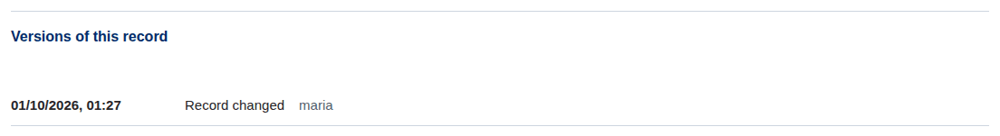

**History** (under the steps) lists the versions of the record saved through the portal, newest first:
when, what (*Record created*, *Record changed*, *Record deleted*, *Spreadsheet import*) and who.

**Restore this version** (editors and administrators, on every version except the current one, and on a
deletion) brings that version's description and targets back into the form. Nothing changes on the
resolver until you check the form and select **Save links**; a deleted record is recreated the same way.

Changes made directly through the API, outside the portal, are not in this history.

## 9. The QR code label

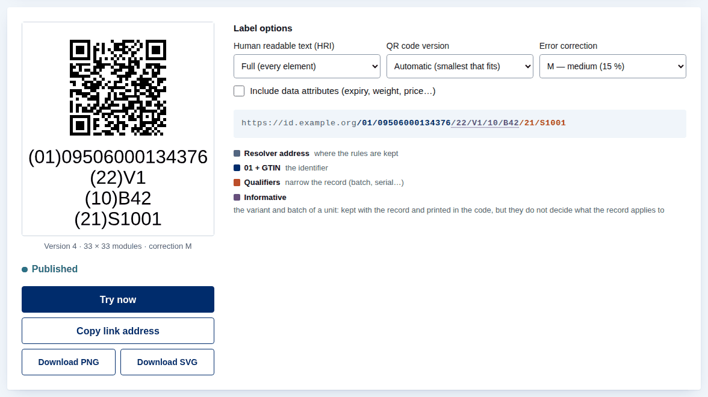

The label block shows the QR code of the record as you type, the GS1 Digital Link it carries (coloured by
part: resolver address, identifier, qualifiers, data attributes) and a legend.

- **Published** / **Not yet registered** tells whether the record exists on the resolver.
- **Try now** opens the Digital Link in a new tab, as a scan would.
- **Copy link address** copies the Digital Link.
- **Download PNG** and **Download SVG** save the label. The SVG is drawn in millimetres at the
  recommended module size (X = 0.495 mm), with a quiet zone of 4 modules and text 2.2 mm high, so it
  prints at the right size when printed at 100 %. Use the SVG for print artwork; the PNG for screens and
  documents.

**Label options**

- **Human readable text (HRI)** — *Full (every element)*: the identifier and each qualifier on its own
  line, as in the picture; *Identification key only*; *None*.
- **QR code version** — *Automatic (smallest that fits)*, or a fixed version from 1 (21 × 21 modules) to
  40 (177 × 177), when the artwork needs a constant size.
- **Error correction** — L (7 %), M (15 %, the default), Q (25 %) or H (30 %): how much of the code can
  be damaged and still be read. The level is applied exactly as chosen.

Under the code the portal shows the version, size and correction actually used, for example
*Version 4 · 33 × 33 modules · correction M*. When the content does not fit the chosen version, the code
is replaced by an explanation and the ways out: a higher version, *Automatic*, a lower correction level or
a shorter content.

## 10. Data attributes in the QR code

*(Available when the installation includes the GS1 Barcode Syntax Engine; otherwise the option is not
shown.)*

Data attributes add information that is not part of the identification — expiry date, net weight,
price, … — to the QR code being drawn, for example
`https://id.example.org/01/09506000134376/22/V1/10/B42/21/S1001?17=271231&3103=000500`.

1. Tick **Include data attributes (expiry, weight, price…)**.
2. In **Attribute (AI)**, pick from the list (*Most used* first, then *All attributes*) or type a number
   or part of a name (`17`, `validade`, `weight`). Each attribute shows the format of its value.
3. Type the **Attribute value**. Dates are YYMMDD; day 00 (“end of month”) is refused and the portal
   suggests the first or last day of the month. Measures and amounts whose number of decimals is part of
   the code are offered as families — (310n) net weight in kg, (392n) price… — and accept the number as
   you write it, with a comma or a point: `123,45` goes into the code as `3102=012345`. The line
   *→ In the URI: …* shows exactly what will be encoded.
4. **+ Add attribute** adds another; the arrows change the order; **×** removes one.

The GS1 Barcode Syntax Engine checks every attribute and the combination (some attributes require
others, some cannot appear together) and the portal explains any refusal. A qualifier of the record
(batch, serial, variant) is never an attribute: open or create the record with that qualifier instead.

> **Attributes are not saved.** They go only into the QR code drawn now and its downloads, and are
> cleared when another record is opened. The resolver passes them on only to targets with *Pass the
> request's query parameters on to this target* ticked.

## 11. Registered records: searching and filtering

**Registered records** (user menu, or *See registered records →*) lists every record you may see, the
most recently changed first: product (description), identifier, what it applies to, number of links
(with a warning badge when the last link check found problems) and the last change made through the
portal (date and user; *no history* for records made elsewhere). Select a description to open the record
in the editor; the browser's back button returns to the list.

### Searching by text

Type in the search field: an identifier (a GTIN with or without leading zeros), a key name (GTIN, SSCC,
GLN…), a description, a batch or serial. Several words narrow the result; capitals and accents are
ignored (*acai* finds *Açaí*).

### Filters

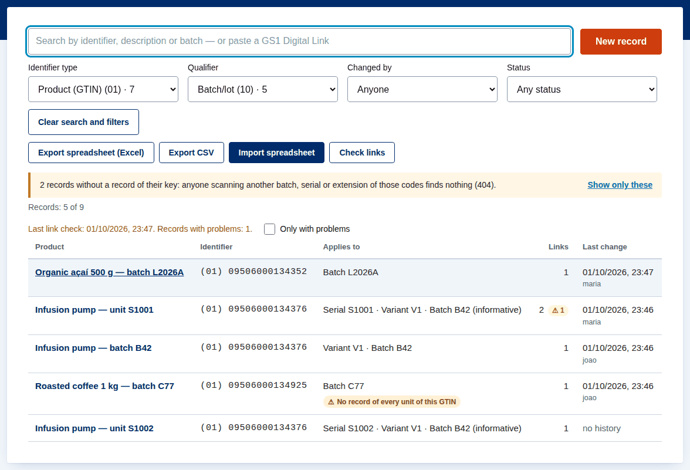

- **Identifier type** — only the records of one primary key type. The list shows only the types present,
  with how many records each has (*Product (GTIN) (01) · 6*).
- **Qualifier** — only the records that have a given qualifier, alone or with others, or as information
  (a serial number with an informative batch appears under *Batch/lot*); *None (applies to the whole identifier)* for the records without
  qualifiers; *Others (created outside the portal)* for qualifier sets the portal does not manage. The
  options follow the identifier type chosen.
- **Changed by** — only the records last changed by one user.
- **Status** — records that need attention: *No record of the key* (a batch, serial number or extension
  whose identifier has no record of its own, so other codes of it answer 404) and *Serial registered with
  batch or variant* (made before the GS1 rule was applied). A badge marks each one in the list, and an
  alert above the list offers **Show only these** while there are records without their key's record.

  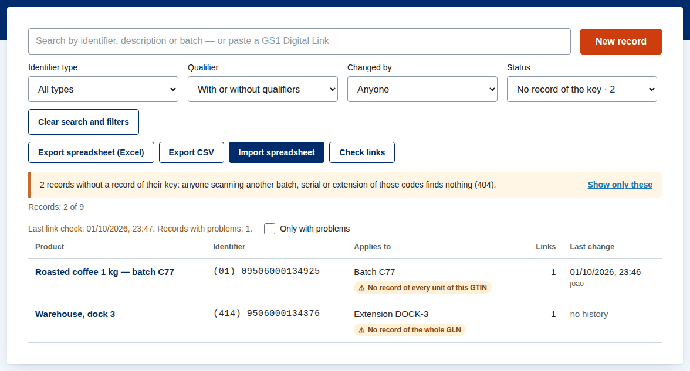
- **Only with problems** — after a link check, only the records whose targets had problems.

**Clear search and filters** appears while any of them is in use. The count line shows how many records
are shown out of the total (*Records: 4 of 9*).

### Finding a code: paste a Digital Link or an element string

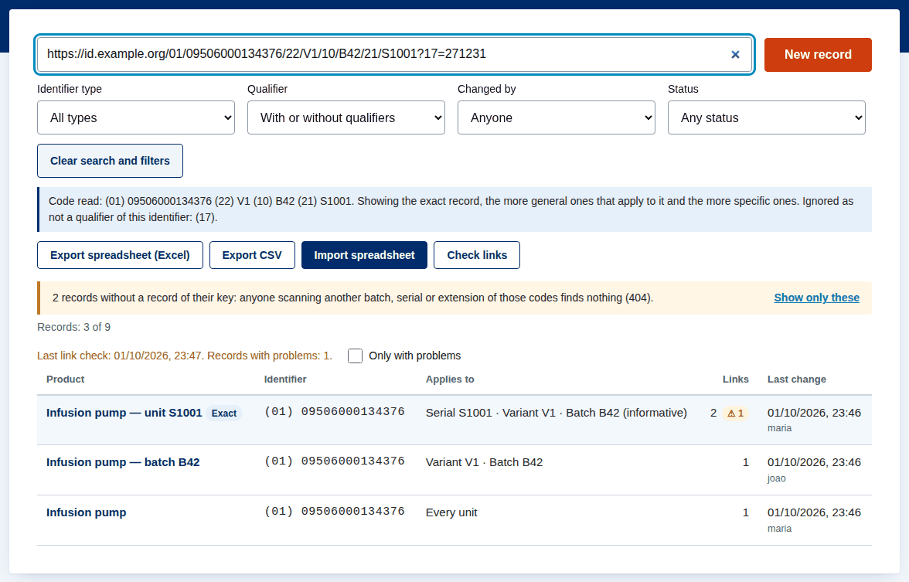

Paste a GS1 Digital Link (from any domain — a scanned QR code, a link from a document) or type an
element string with the AIs in brackets, such as `(01)09506000134376(10)B42`, and the list shows the
records related to that code:

1. the **exact** record (badge **Exact**): same identifier and qualifiers;
2. the more general records that apply to it — the batch, the variant, the product;
3. the more specific records — for a batch, its serial numbers.

Other batches, variants and serial numbers are left out. A line under the filters shows the code as read,
and names the parts that are not qualifiers of that identifier (data attributes such as (17)), which are
ignored because they are never stored. A GTIN of 8, 12 or 13 digits is completed to 14. A Digital Link
of the identifier alone lists every record of that identifier.

## 12. Spreadsheets: export and import

### Export

**Export spreadsheet (Excel)** or **Export CSV** downloads every record you may see, one row per target,
with the column titles in your language:

| Column | Content |
|---|---|
| Key (AI) | the primary key: 01, 414, 00… |
| Identifier | the identifier (GTIN with 14 digits) |
| Qualifiers | empty for the whole identifier; otherwise `(10)L1(21)S1` |
| Description | the record's description |
| Link type | `gs1:pip`, `gs1:instructions`… |
| URL | the target's address |
| Language | `pt`, `en`, `pt-BR`… |
| Title | the target's title |
| Default | *yes* on the default target of the record |
| Forward query string | *yes* or *no* |

The Excel file also has reference sheets: **Link types** (code, name, description), **Keys** and
**Languages**. Cells that could be read as formulas are protected, so the file is safe to open.

### Import

Use the exported spreadsheet as a template. Rows with the same key, identifier and qualifiers form one
record; the **Default** column marks the target that opens first.

1. **Import spreadsheet** (editors and administrators) opens the dialog. Choose the file: Excel (.xlsx),
   CSV or text (.csv, .txt). The dialog shows the limits per file (5,000 data rows and 700 KB for each
   format); split larger files.
2. Optionally tick **Also check that the addresses answer** (section 13).
3. The portal checks every row with the editor's rules and shows a **preview** — *New*, *Changed*,
   *Unchanged*, *With errors* — and, for every wrong row, the row number and the reason (an invalid
   identifier, an address without `https://`, an unknown language, two default targets…). Nothing has
   been written yet.
4. **Import records (n)** writes the valid records; records with errors are skipped. Correct the
   spreadsheet and import it again to include them.

A serial number is written as in the label — `(22)V1(10)B42(21)S1` — and imported the same way: the
record is the serial number's, and the variant and batch are kept with it as information. When an import
changes the batch of an existing serial number, the preview shows the one it had (*before: …*).

When the file would leave an identifier with batches or serial numbers only, without a record of its own,
the preview lists those identifiers and offers **Also create the record of each one, with the targets of
its first row in the spreadsheet** (ticked). Untick it to import only the rows of the file.

An import never deletes anything: records that are not in the file stay as they are. It is recorded in the
history of each record and in the audit trail.

**Tips for Excel.** Format the Identifier column as *Text* before typing, otherwise Excel turns long
codes into scientific notation (the portal detects it and says so). CSV files saved by Excel in Portuguese
(“;” separator, Windows encoding) and “Unicode text” files are recognised.

## 13. Checking that the targets answer

The link checker asks each address whether it answers, without changing anything:

- **In the editor** — automatically after each save, and on demand with **Check targets**: the targets in
  the form are checked and the result is written under each one (*✓ Answered normally.* or the problem).
- **Every record** — **Check links** in the record list checks all the targets in the background; the
  summary (*Last link check: … Records with problems: 2.*) stays until the next check, a badge marks each
  record with problems, and **Only with problems** filters them. Opening such a record checks its
  targets again.
- **Import preview** — the option in the import dialog.

Problems reported: an error answer (404, 500…), a site that refuses automatic checks (open the address
in a browser to confirm), a site that does not answer, a redirect to a page without HTTPS, more than 5
redirects, an internal network address (never contacted) or an invalid address. Some sites answer
“page not found” with a normal page; the checker cannot detect those.

## 14. Administration: users

**Users** (user menu, administrators) manages who may use the portal.

**Create a user.** Enter the **User** name (3 to 64 letters, digits, `.`, `-`, `_` or `@`), choose the
**Role** and, optionally, the **GS1 Company Prefixes** (4 to 12 digits each, separated by commas; empty
means every identifier), then **Create user**. The portal shows a **temporary password once**: copy it
(**Copy password**) and send it through a secure channel. The user must change it at the first sign-in.

**Registered users** lists each user with role, prefixes, status (*Active*, *Disabled*, *Waiting for the
temporary password to be changed*) and last sign-in. For each one:

- change the role or prefixes and **Save**;
- **Reset password** — a new temporary password, shown once; the user's open sessions end;
- **Disable** / **Enable** — a disabled user cannot sign in, and keeps the account;
- **Remove** — deletes the account; the user's changes stay in the history and audit trail.

You cannot disable, demote or remove your own user, and the portal always keeps at least one active
administrator. Users created before roles existed are administrators.

## 15. Administration: audit trail

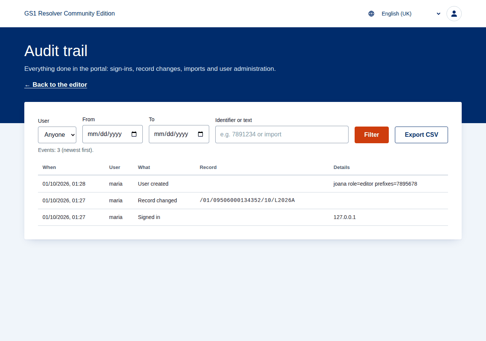

**Audit trail** (user menu, administrators) lists everything done in the portal, newest first: sign-ins
(and refused sign-ins), sign-outs, password changes, record creations, changes and deletions, imports,
exports and user administration.

Filter by **User**, by date (**From**, **To**) and by **Identifier or text** (a GTIN, a prefix, *import*…),
then **Filter**. **Export CSV** downloads the same events for Excel. An administrator limited to some GS1
Company Prefixes sees only the record events of those prefixes.

## 16. Messages and what to do

| Message | What to do |
|---|---|
| *The check digit does not match: it should be N.* | Check the digits typed; the last digit is calculated from the others. |
| *The identifier must start with a GS1 Company Prefix…* | Alphanumeric keys (GMN, CPID, GINC, GIAI) start with the digits of the company prefix. |
| *The standard does not allow this combination of qualifiers…* | Use one of the combinations in section 5 (e.g. TPX alone, or 7040 without 254). |
| *You changed the code. Select Open record to see its targets.* | Select **Open record**; steps 2 and 3 unlock. |
| *This identifier has other records (…) that open … first.* | Keep the shared default type as the first target (section 5). |
| *Targets N and M have the same type and language.* | Change the language of one of them, or remove one. |
| *This identifier does not belong to the GS1 Company Prefixes of your user.* | Ask an administrator to add the prefix to your user. |
| *Your role does not allow this action.* | Ask an administrator for the editor role. |
| *The content does not fit version N with correction L.* | Choose a higher version or *Automatic*, a lower correction, or fewer attributes. |
| *The resolver did not respond.* | Try again in a few minutes; if it persists, tell the administrator. |
| *Your session has ended. Please sign in again.* | Sign in; unsaved changes in the form are lost. |
| *Too many unsuccessful attempts. Try again in N minute(s).* | Wait, or ask an administrator to reset your password. |

## 17. Glossary

- **AI (Application Identifier)** — the number in brackets that says what a value is: (01) GTIN,
  (10) batch/lot, (17) expiry date…
- **Data attribute** — extra information in a Digital Link's query string (expiry, weight, price); never
  stored by the resolver.
- **Default target** — the target that opens when the code is scanned without asking for a specific type.
- **Element string** — the bracketed form printed under barcodes: `(01)09506000134352(10)L2026A`.
- **GS1 Company Prefix** — the first digits of an identifier, allocated by GS1 to a company.
- **GS1 Digital Link** — a web address that carries GS1 identification keys.
- **HRI (human readable interpretation)** — the text printed with a code.
- **Link type** — what a target is about, from the GS1 Web Vocabulary (`gs1:pip`, `gs1:instructions`…).
- **Primary identification key** — the main identifier: GTIN, GLN, SSCC, GRAI…
- **Qualifier** — a value that narrows a key: variant, batch/lot, serial number, GLN extension…
- **Record** — an identifier with its qualifiers, description and targets.
- **Resolver** — the service that answers GS1 Digital Links and sends people to the registered targets.
- **Target** — a web page or document registered for a record.
