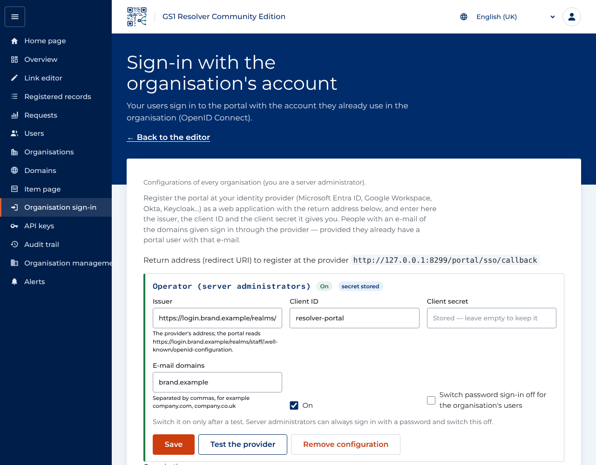
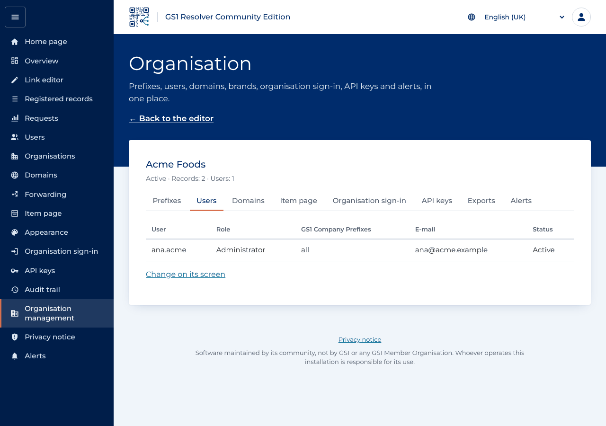
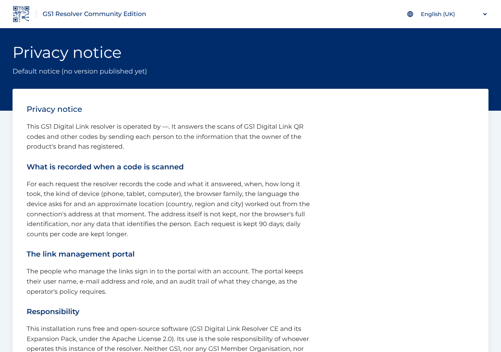
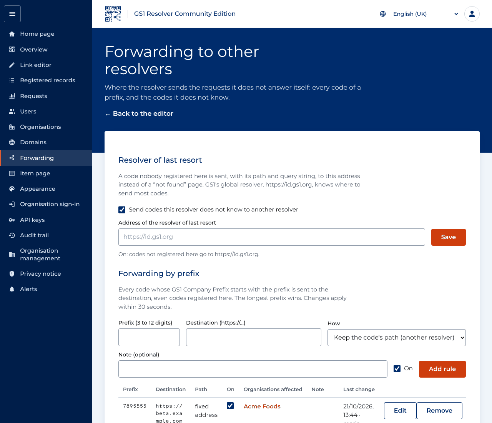
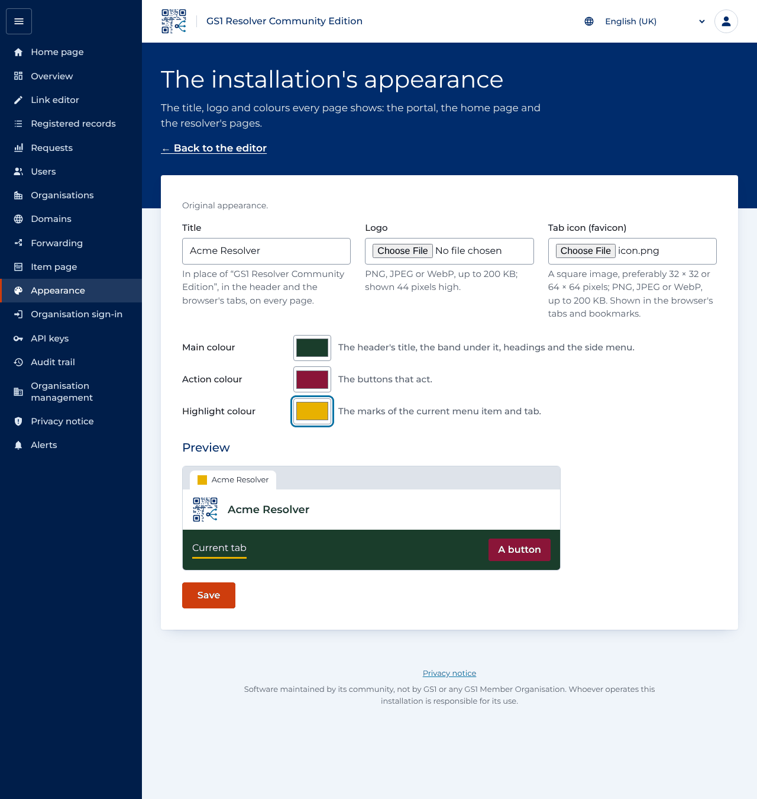
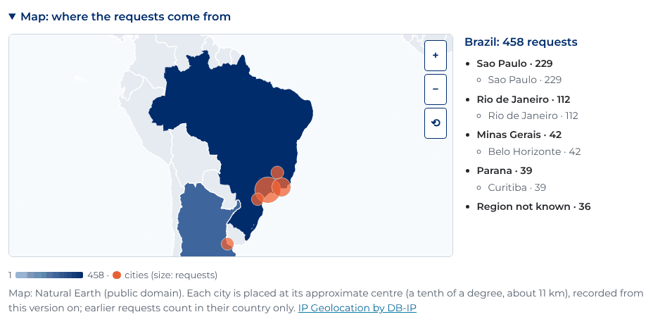
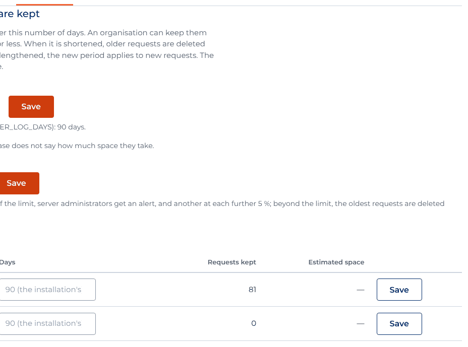

# Link management portal — user guide

This guide explains how to use the link management portal of the GS1 Digital Link Resolver CE —
Expansion Pack, task by task. It is written for the people who register products, places, documents and
other identified items, and for the administrators who manage their accounts. No technical knowledge is
needed. The portal is available in Brazilian Portuguese and British English; the screenshots show the
English version.

For installation and operation see the [README](../README.md); for how the portal works inside see the
[developer guide](developer-guide.md).

## Contents

1. [What the portal does](#1-what-the-portal-does)
2. [Roles: what each user can do](#2-roles-what-each-user-can-do)
3. [Signing in, language and password](#3-signing-in-language-and-password)
4. [The editor at a glance](#4-the-editor-at-a-glance)
5. [Creating or changing a record](#5-creating-or-changing-a-record)
6. [Other records of the same identifier](#6-other-records-of-the-same-identifier)
7. [Deleting a record](#7-deleting-a-record)
8. [History of a record](#8-history-of-a-record)
9. [The QR code label](#9-the-qr-code-label)
10. [Data attributes in the QR code](#10-data-attributes-in-the-qr-code)
11. [Registered records: searching and filtering](#11-registered-records-searching-and-filtering)
12. [Spreadsheets: export and import](#12-spreadsheets-export-and-import)
13. [Checking that the targets answer](#13-checking-that-the-targets-answer)
14. [Administration: users, organisations and settings](#14-administration-users-organisations-and-settings)
15. [Administration: audit trail](#15-administration-audit-trail)
16. [Requests to the resolver](#16-requests-to-the-resolver)
17. [The overview](#17-the-overview)
18. [Messages and what to do](#18-messages-and-what-to-do)
19. [Glossary](#19-glossary)

---

## 1. What the portal does

A **GS1 Digital Link** is a web address that carries a GS1 identification key, for example
`https://id.example.org/01/09506000134352/10/L2026A` for the product with GTIN 09506000134352, batch
L2026A. Printed as a QR code, it takes whoever scans it to a web page. The **resolver** is the service at
that address: it looks the identifier up and sends the person on to the page registered for it.

The portal is where those pages are registered. For each identified item you keep a **record** with:

- the **identifier**: a primary identification key (GTIN, GLN, SSCC, …) and, optionally, **qualifiers**
  that narrow it (variant, batch/lot, serial number, …);
- a **description** (the name of the product, place or document);
- one or more **targets**: web pages or documents, each of a **link type** (product information,
  instructions, safety information…) and a **language**. One of them is the **default target**, the one
  that opens when someone simply scans the code.

Changing a target takes effect immediately for every code already printed: packaging never needs to be
reprinted to change where the code leads.

The portal also produces the QR code label of each record, lists every record, imports and exports them
as spreadsheets, checks that the targets answer, and keeps the history of every change.

## 2. Roles: what each user can do

Each user has one role. An administrator chooses it (section 14).

| Action | Reader | Editor | Administrator |
|---|:-:|:-:|:-:|
| Open records, see their targets, labels and history | ✓ | ✓ | ✓ |
| Download QR code labels (PNG, SVG) | ✓ | ✓ | ✓ |
| See and search the record list; export spreadsheets | ✓ | ✓ | ✓ |
| Create, change, delete and restore records | | ✓ | ✓ |
| Import spreadsheets; check links | | ✓ | ✓ |
| See the requests to the resolver of their records | ✓ | ✓ | ✓ |
| Manage users; see the audit trail; see the calls of API keys | | | ✓ |

A user may also be limited to one or more **GS1 Company Prefixes**: they then see and change only the
identifiers that belong to those prefixes, in every screen, spreadsheet and report. Without prefixes a
user works with every identifier on the resolver.

Readers see the editor with every field read-only and the note *Your role is read-only: you can consult
and export, but not change.*

**Organisations.** An installation may serve several organisations, each owning its GS1 Company Prefixes
(section 14). A user belongs to one organisation, or to the operator that runs the installation, and sees only
that organisation's records (or the operator's: those that belong to no organisation). The account menu shows
the organisation's name; the operator's administrators see *Server administrator* there.

## 3. Signing in, language and password

Open the portal address (for example `https://id.example.org/portal/`), enter your **Username** and
**Password** and select **Sign in**. The portal opens on the **Overview** (section 17); **Link editor** in the user
menu, or the portal's address itself, opens the editor. If you have no account, ask the resolver administrator. If you have
forgotten your password, use **Forgotten your password?** when the page offers it (installations with e-mail,
below); otherwise ask the administrator for a new temporary password.

- **Organisation account (single sign-on).** When your organisation has set it up, **Sign in with your
  organisation's account** asks for your work e-mail and takes you to your organisation's sign-in page (Microsoft,
  Google…); you come back signed in. Your portal user must already exist with that e-mail — ask your administrator
  otherwise. If your organisation has switched password sign-in off, the portal tells you to use this button.
- **Temporary password.** A new account, or one whose password an administrator has reset, starts with a
  temporary password. After signing in the portal asks you to set your own password before going on.
- **Show the password.** The eye button inside a password field shows what you typed; it hides again when
  the form is sent.
- **Too many attempts.** After 5 wrong passwords the account (and the computer they came from) waits
  15 minutes before trying again.
- **Session.** The session ends after 30 minutes without use, and 12 hours after you signed in in any case
  (the administrator can change both). Typing, clicking and scrolling count as use, even before you save.
  Two minutes before the end a window counts down: choose **Stay signed in** to carry on, or **Sign out**.
  Near the 12-hour limit the window cannot extend the session: save your work and sign in again. When the
  session ends the portal asks you to sign in again; other tabs of the portal share the same session.
- **Language.** The language menu at the top right switches at once, without losing what you typed, among
  twelve languages, each named in itself — first those written in the Latin alphabet, alphabetically: Deutsch,
  English (UK), Español, Français, Italiano, Português (Brasil), Türkçe; then العربية (written right to left), हिन्दी,
  中文（简体）, 日本語 and 한국어. The portal starts in the language of your
  browser and remembers your choice; the resolver's own pages, the item's page and the home page follow the same
  choice, and your e-mails come in the language chosen in **Options**. The translations other than Portuguese and
  English are drafts not reviewed by native speakers — corrections are welcome in the repository; the names of the GS1
  Application Identifiers stay GS1's English names in them.

### Forgotten password and invitations (installations with e-mail)

When the installation sends e-mail, the sign-in page shows **Forgotten your password?**. Enter your **user name
or e-mail address** and select **Send the link**. The page always gives the same answer, whether or not an
account matched, so it does not tell anyone who has an account here. If your account has an e-mail address, a
message arrives with a link valid for 60 minutes (check the spam folder). Only the newest link works, once.
After three requests for the same name the page asks you to wait 15 minutes.

The link opens **Choose a new password** with your user name: type the new password twice (at least 12
characters) and select **Save the password**. The portal goes back to the sign-in page with your user name
filled in; every session open with the old password ends, and a message tells you the password was changed. An
**invitation** from an administrator opens the same page, titled *Welcome: choose your password*, and is valid
for 72 hours. If the page says the link is no longer valid, it has expired, has been used or a newer one was sent:
ask for a new one. If someone else is signed in in the same browser when you open a link, that session ends first.

The portal also writes to you, always, when your password or your e-mail address is changed (to the old and the
new address) and when your account is locked after five wrong passwords: if you did not do it, use **Forgotten
your password?** at once and tell your administrator.

### The user menu

The round button at the top right opens the user menu: your user name, **Home page** (the resolver's
home page), **Overview** (section 17), **Link editor** (sections 4 to 10), **Registered records** (section 11),
**Requests** (section 16), **Users**, **API keys** and **Audit
trail**, **Organisation management** and **Alerts** (administrators only; **Organisations**, **Forwarding**,
**Appearance** and **Privacy notice** for server administrators),
**Options** and **Sign out**. On a wide screen (1,100 pixels or more) the same screens are also in a **side menu** on
the left, the current one marked; the button at its top folds it to its icons and opens it again (the browser
remembers the choice). The screens use up to 1,536 pixels of a wide monitor (96rem); the list of requests fits a
1,280-pixel screen with the side menu open. On a phone every screen fits the width; wide tables scroll sideways inside
their own box.

Questions such as *Remove this user?* open in the portal's own window: **Confirm** goes ahead, **Cancel** (or the Esc
key) keeps everything as it was. What cannot be undone has a red button.

### Changing your password

**Options** opens the password form. Enter the **Current password**, the **New password** (at least
12 characters) and **Repeat the new password**, then **Save password**. Every other session open with your
account (another browser, another computer) is signed out; the current one stays open.

### E-mail preferences

With e-mail, **Options** also shows **E-mail**: the address messages go to (only an administrator can change it),
the **Language of the messages** (at first the language of the page you sign in with) and the messages you want.
Security notices are always sent; **When an import or link check I started has finished** is optional, useful for
long imports and for **Check every record's links**. Administrators also choose **Monitoring alerts** (on until
switched off): the resolver not answering, a daily backup that failed or is late, the HTTPS certificate about to
expire, and spikes of scans of codes nobody registered (an organisation's administrators receive these for its codes
only). Select **Save preferences**.

## 4. The editor at a glance

The **editor** opens from **Link editor** in the user menu, from the portal's own address (`/portal/`) and from a code
chosen in the record list or the overview (the page that opens after signing in is the **Overview**, section 17). It
has three numbered steps and, under them, the **label block** with the QR code:

1. **What does the code identify?** — the identifier type, the identifier and its qualifiers, and the
   **Open record** button.
2. **Description** — what the item is called.
3. **Targets** — where the code leads.

The link under the page title, *See registered records →*, opens the record list.

## 5. Creating or changing a record

The same steps create a new record or change an existing one: the portal finds out which, when you open
the record.

### Step 1 — identify the item

1. Choose the **Identifier type**. The list holds every primary identification key of GS1 Digital Link:
   Product (GTIN), Individual trade item piece (ITIP), Global Model Number (GMN), Component/Part
   Identifier (CPID), Physical location (GLN), Invoicing party (GLN), Party (GLN), Service provider and
   Service recipient (GSRN), Global Coupon Number (GCN), Logistic unit (SSCC), Document (GDTI),
   Consignment (GINC), Shipment (GSIN), Returnable asset (GRAI) and Individual asset (GIAI).
2. Type the identifier. For a GTIN, type the digits printed beneath the barcode: 8, 12, 13 or 14 digits;
   spaces, full stops and hyphens are ignored and the portal completes the GTIN to 14 digits. The message
   under the field checks it as you type — the length, the check digit (and which one it should be), the
   allowed characters, the GS1 Company Prefix at the start. When the server administrator has loaded GS1's GCP
   length table, a second line names the key's GS1 Company Prefix and its number of digits by that list (with its
   date), or says that the range is not a GS1 Company Prefix (restricted circulation numbers, coupons, ISBN…).
3. **Qualifiers** (only for the types that have them). Leave them blank for a record that applies to
   every unit of the item. Fill them in to narrow the record, for example to one batch or one serial
   number. Each field explains its format under it. The portal accepts only the combinations the
   standard allows and says why when it refuses one:

   | Identifier | Qualifiers |
   |---|---|
   | GTIN (01) | Product variant (22), Batch/lot (10), Serial number (21) — any of them, in this order (with a serial number, variant and batch are informative, see below); or Third-party serialised extension — TPX (235) alone |
   | ITIP (8006) | Batch/lot (10), Serial number (21) (with a serial number, the batch is informative) |
   | CPID (8010) | Component serial number (8011) |
   | GLN (414) | GLN extension (254), or UIC with extension and importer index (7040) |
   | Invoicing party GLN (415) | Payment reference number (8020), required |
   | Party GLN (417), GIAI (8004) | UIC with extension and importer index (7040) |
   | GSRN (8017, 8018) | Service relation instance number (8019) |
   | GMN, GCN, SSCC, GDTI, GINC, GSIN, GRAI | none |

   **A serial number with its batch or variant.** Type everything printed on the package: variant, batch
   and serial number. With a serial number, the variant and batch fields are marked *informative* and get a
   dashed border. The GS1 standard (GS1-Conformant Resolver, section 2.5.9) does not let a serial-number
   record depend on its batch or variant, so the record applies to the serial number; the batch and
   variant are kept with it — you can search, filter and export by them — and printed in the QR code.
   Someone who scans another unit of that batch without a record of its own goes to the batch's record,
   if there is one, and then to the product's.

   Under the qualifiers, the card **This record applies to** says it in plain words, for every
   combination: *every unit of this GTIN*, *Batch L1*, *Serial S1*…

   

4. Select **Open record**. The portal asks the resolver and answers:
   - *Record found. Change whatever you need and save.* — the record exists; steps 2 and 3 show what is
     registered;
   - *No record yet. Complete the steps below.* — a new record;
   - when the identifier has other records (the product and some batches, for instance), it says so and
     lists them under the button (section 6).

If you change the identifier or a qualifier after opening a record, steps 2 and 3 are locked and the
portal asks you to select **Open record** again, so that you never overwrite another record by mistake.
If the record had changes you had not saved, **Open record** asks before discarding them. Changing only
the informative batch or variant of a serial number keeps the record open.

Opening a serial number without its batch or variant fills in the ones kept with it. If you type a
different batch, the portal keeps what you typed and points out the difference: saving replaces the
stored batch.

### Step 2 — description

Type what the item is called: *Disposable syringe 5 ml*, *Warehouse — dock 3*, *Invoice 2026-001*
(up to 200 characters). The description is shown in the record list and in the resolver's pages.

### Step 3 — targets

Each target is one web page or document. For each target fill in:

- **Type** — what the page is about, from every link type of the GS1 Web Vocabulary (57 in version 1.16): Product
  information (`gs1:pip`), Instructions, Support, Digital product passport, Electronic instructions for use, Recall
  status, Nutritional information, Location and directions, Opening hours, Traceability, Master data (B2B) and the
  others, in groups (most used, food, healthcare, consumer, use and after-sales, business to business, places,
  organisation). The groups come in the order that suits the identifier: the most used first for a product, places
  first for a GLN, business to business first for an SSCC or an asset. The text under the field explains the type
  chosen.
- **Language** — the language of the page: click the field (or its ▾ button) and a list of every language opens —
  over 200: each ISO 639-1 language and the usual regional variants (`pt-BR`, `en-GB`, `es-419`, `zh-Hans`…), named in
  the portal's language, those written in the Latin alphabet first, alphabetically. Scroll it, or type part of a name
  or code to filter it (*German*, `de`), then click one or use the arrow keys and Enter. Several languages for one page are separated by commas. A language the list does not know is accepted
  when it is a well-formed code; anything else is pointed out and the record is not saved until it is fixed. Two targets of the same type are allowed only in different languages: the resolver then
  sends each person to the version in their browser's language. Someone whose language has no version
  gets the default target (the first one).
- **Address (URL)** — the full address, starting with `https://`. Copy it from the browser's address bar;
  spaces, line breaks and invisible characters are refused.
- **Title** (optional) — a short name shown in lists of links and on the item's page. Left empty, the link gets its
  type's name in the link's language (Portuguese or English) — and a new one if you change the language later.

The first target is the **default target** (badge *Default target*, `gs1:defaultLink`): it opens when
someone scans the code without asking for anything in particular. **Make default** on another target
moves it to the top; **Remove** deletes a target; **Add target** adds one (up to 20 per record).

> **One default type per identifier.** All the records of the same identifier (the product, its
> batches, its serial numbers) share the same *type* of default target, because the resolver keeps it
> once per identifier. When other records exist, the portal shows that type and asks you to keep it first.

**Copy targets from…** opens a search over every record: choose one and **Add to the targets** (after
the ones in the form) or **Replace the targets**. Nothing is saved until you select **Save links**.

**Check targets** asks each address whether it answers (section 13); it never stops you from saving.

**Default target: the item's page.** Tick this option (above the targets) when the code should open a page with
**all** the targets instead of only the first one: the resolver makes that page — mobile first, one large button with an
icon for each type of target, in the language of the phone when the target exists in it, otherwise in the best
language available, marked with that language (the other translations under *Other languages*: nothing is hidden), the
batch's and the product's targets when a batch is scanned, and the brand of your GS1 Company Prefix (logo — also the
page's icon in the browser's tab — and colours, set by an administrator under **Item page**, section 14). With the
option no target is marked as the default. **Each record chooses for itself**: the product can open its page while a
batch or serial number goes to its own first target, or the other way round. A scan of the GTIN alone, or of a batch
that has no record, follows the product's choice. Above the targets the editor lists how the identifier's other
records do it (*Using the item's page: …*, *Going to their own default target: …*), and a new batch starts with the
product's choice. Behind the scenes each record then carries its own default link (`gs1:defaultLink`); the portal
writes it and does not show it, and nothing changes for the other records' targets. The page counts its **views** and the **clicks** on its buttons (section 16);
nothing about the person is kept. When the installation has switched it on, the page also offers **Check this code in
Verified by GS1** for a GTIN or a GLN, where anyone can see who licensed the code.

### Saving

Select **Save links**. The portal checks everything again on the server and answers:

- *Record created. The code now leads to the targets you entered.*
- *Changes saved. The code now leads to the new targets.*

**A record above it.** The GS1 standard asks that any code, however detailed, find a default target at
its level or above. When you save a batch, serial number or extension of an identifier that has no record
of its own, the portal asks first:

- **Also create the record of every unit of this GTIN, with the same targets** — *recommended*, and
  chosen already. You can change those targets later in that record;
- **Create it with another target** — for instance the product's general page instead of the batch's
  page; the type and language are those of your default target;
- **Save only this record** — the other batches and serial numbers of the identifier get no answer
  (error 404) until someone creates that record, and the record list flags it.

The description of the new record can be changed in the same window. **Cancel** saves nothing.
Identifiers that cannot exist without a qualifier (invoicing party GLN with its payment reference) are not
asked about.

After saving, the portal also checks that the targets answer and warns under any that does not
(section 13); the record is saved either way. If something is wrong, the message says what and where (for instance *Enter the address (URL) of target
2.*). The label block shows **Published** once the record exists on the resolver.

## 6. Other records of the same identifier

When the identifier has other records — the product itself, its batches, its serial numbers, its
variants — a box under **Open record** lists them: *Other records of this GTIN (3)*. For each one it shows
what it applies to (*Every unit*, *Batch L2026-03 · Serial S0001*), its description, number of links and
the last change made through the portal.

- Type in the search field to find a batch, serial, variant or description.
- Use the filter to show only the records with a given qualifier, or *No qualifiers (every unit)*.
- Five rows are in view at a time; scroll the list to see more.
- **Open** loads that record in the editor. If the record being edited has unsaved changes, the portal
  asks first: *This record has unsaved changes. Opening another one discards them. Continue?*

Records created elsewhere with qualifiers the portal cannot manage (such as a batch template
`{lotnumber}`) are listed but cannot be opened; change them through the API.

## 7. Deleting a record

**Delete this record** (shown for an existing record, editors and administrators) asks for confirmation and
then removes **only the record being edited**: deleting a batch keeps the product and the other batches;
deleting the record without qualifiers keeps the batches and serial numbers. After the deletion the code
no longer leads to those targets — a scan of a batch then uses the product's targets, if the product has
a record.

The deletion is kept in the history and in the audit trail, so the record can be recreated from there.

## 8. History of a record

**History** (under the steps) lists the versions of the record saved through the portal, newest first:
when, what (*Record created*, *Record changed*, *Record deleted*, *Spreadsheet import*) and who.

**Restore this version** (editors and administrators, on every version except the current one, and on a
deletion) brings that version's description and targets back into the form. Nothing changes on the
resolver until you check the form and select **Save links**; a deleted record is recreated the same way.

Changes made directly through the API, outside the portal, are not in this history.

## 9. The QR code label

The label block shows the QR code of the record as you type, the GS1 Digital Link it carries (coloured by
part: resolver address, identifier, qualifiers, data attributes) and a legend.

- **Published** / **Not yet registered** tells whether the record exists on the resolver.
- **Try now** opens the Digital Link in a new tab, as a scan would.
- **Copy link address** copies the Digital Link.
- **Download PDF** saves the label as a vector PDF the size of the label, and **Download all (ZIP)** the SVG,
  PNG and PDF together with a text file of the sizes.
- **Download PNG** and **Download SVG** save the label. The SVG is drawn in millimetres at the
  recommended module size (X = 0.495 mm), with a quiet zone of 4 modules and text 2.2 mm high, so it
  prints at the right size when printed at 100 %. Use the SVG for print artwork; the PNG for screens and
  documents.

**Label options**

- **2D symbol** — *QR code (GS1 Digital Link)*, the default; *Data Matrix (GS1 Digital Link)*: the same address in a
  Data Matrix; or *GS1 DataMatrix (element string)*: the record's element string — the key, its qualifiers and any data
  attributes, as `(01)…(10)…` — in the GS1 DataMatrix that healthcare and industry scan (not an address: a scan gives
  the data, not the links). One 2D symbol per label; the EAN/UPC can stand beside any of them. The downloads carry the
  symbol chosen and are named after it (`qrcode_…`, `datamatrix_…`, `gs1datamatrix_…`).
- **Scanning environment** — where the code will be scanned: one of the symbol specification tables of the GS1
  General Specifications (release 26.0, section 5.12.3), which sets the module size range and the symbols allowed.
  Only the environments of the record's key are offered, its usual one first. The **Size** list then offers only the
  sizes within the range. Which to choose, following the specifications' decision tree (figure 5-68):

  | Where the code is scanned | Environment (table) | 2D symbols, X in mm (min–max, target) | EAN/UPC, X in mm |
  |---|---|---|---|
  | GTIN at the retail checkout only | *Retail point of sale* (1) | all, 0.396–0.990 (0.495) | 0.264–0.660 |
  | GTIN at the checkout and in warehouses (cases scanned in general distribution) | *Retail point of sale and general distribution* (3) | all, 0.743–0.990 (0.990) | 0.495–0.660 |
  | GTIN in general distribution only | *General distribution only* (2) | all, 0.743–1.50 (0.743) | 0.495–0.660 |
  | Regulated healthcare item sold in a pharmacy | *Healthcare: retail pharmacy* (10) | Data Matrix, 0.396–0.990 (0.495) | 0.264–0.660 |
  | Regulated healthcare item in a pharmacy and in general distribution | *Healthcare and general distribution* (8) | Data Matrix, 0.750–1.520 (0.750) | 0.495–0.660 |
  | Regulated healthcare item outside retail, e.g. hospitals | *Healthcare, non-retail* (6) | Data Matrix, 0.254–0.990 (0.380) | 0.170–0.660 |
  | Neither retail, nor distribution, nor regulated healthcare | *Neither retail nor distribution* (4) | all, 0.375–0.990 (0.495) | 0.264–0.660 |
  | SSCC (logistic units) | *Logistic units, SSCC* (5) | all, 0.743–1.50 (0.743) | — |
  | GDTI, GRAI, GIAI, GLN | *GDTI, GRAI, GIAI and GLN* (9) | all, 0.375–0.743 (0.375) | — |
  | GSRN | *GSRN* (11) | all, 0.254–0.495 (0.380) | — |
  | Marked directly on the item (any key) | *Direct part marking* (7) | all, 0.254–0.615 (0.300) | — |

  The healthcare tables name only the GS1 DataMatrix: there the QR code is not offered. Tables 12 (tobacco under EU
  Regulation 2018/574) and 13 (long distance scanning) are not offered: they ask for a print quality or a range the
  label does not set; GS1-128 and GS1 DataBar, which several tables name, are not drawn by the portal.
- **Text in the SVG** — *Outlines, no font needed* (the default: it looks the same everywhere) or *Text, editable
  (needs the fonts)*: real text an artwork program can change, in Liberation Sans and OCR-B for the EAN/UPC digits;
  the printer must have those fonts. PNG and PDF always draw outlines.
- **Human readable text (HRI)** — *Full (every element)*: the identifier and each qualifier on its own
  line, as in the picture; *Identification key only*; *None*.
- **QR code version** (QR code only) — *Automatic (smallest that fits)*, or a fixed version from 1 (21 × 21 modules) to
  40 (177 × 177), when the artwork needs a constant size.
- **Error correction** (QR code only) — L (7 %), M (15 %, the default), Q (25 %) or H (30 %): how much of the code can
  be damaged and still be read. The level is applied exactly as chosen.
- **Size** — a percentage of the scanning environment's target size (at retail 80 % to 200 %); each choice shows
  the module size (at retail X 0.396 mm to 0.990 mm).
  The text under the code stays 2.2 mm high at every size. Use 100 % unless the artwork needs another.
- **Linear barcode beside it** (GTINs of products, indicator 0) — *None*; *EAN-13 / UPC-A / EAN-8, as the GTIN
  takes*; or *UPC-E* for a GTIN-12 that allows it: the familiar barcode drawn next to the 2D symbol, with its digits
  underneath, so that every till scans the product while the QR code gives the links.
- **Size of the linear barcode** (shown with a linear barcode) — *As the 2D symbol* (the default: the same percentage,
  or the nearest the environment's EAN/UPC range allows; the choice shows which and its module size), or a size of its
  own within the EAN/UPC range (at retail 80 % to 200 %, X 0.264 mm to 0.660 mm). Each symbol keeps to its own range:
  in *General distribution only*, for example, the 2D symbol can go to 200 % beside an EAN-13 at 100 %.
- **Domain in the QR code** (shown when your organisation has a verified domain, section 14) — *Default of the
  prefix*: the domain set as the default of the record's GS1 Company Prefix, otherwise the resolver's address; the
  resolver's address; or one of your verified domains. The address under the code and the downloads follow the
  choice. A longer address needs a larger QR version.

Under the code the portal shows the version, size and correction actually used, for example
*Version 4 · 33 × 33 modules · correction M*, or for a Data Matrix its modules and module size, for example
*GS1 DataMatrix (element string) · 18 × 18 modules · X 0.380 mm*. When the content does not fit the chosen version, the code
is replaced by an explanation and the ways out: a higher version, *Automatic*, a lower correction level or
a shorter content.

**RFID and NFC (EPC).** For every key the EPC Tag Data Standard encodes, the block offers *RFID and NFC (EPC)* once the
record holds what the EPC needs:

| Key | EPC | Needs first |
|---|---|---|
| GTIN | SGTIN-96 (a numeric serial number without leading zeros), else SGTIN-198 | a serial number (21) |
| SSCC | SSCC-96 | — |
| GLN | SGLN-96 (a numeric extension without leading zeros), else SGLN-195 | — (without an extension (254), the EPC carries the extension 0) |
| GRAI | GRAI-96 / GRAI-170 | its serial component after the 14 digits |
| GIAI | GIAI-96 (digits only) / GIAI-202 | — |
| GSRN, GSRNP | GSRN-96, GSRNP-96 | — |
| GDTI, GCN | GDTI-96 / GDTI-174, SGCN-96 | the serial component after the 13 digits |
| CPID | CPI-96 / CPI-var | its serial (8011) |
| ITIP | ITIP-110 / ITIP-212 | a serial number (21) |

The other keys (GINC, GSIN, party GLN…) have no EPC. The block shows the EPC in hexadecimal (to write into an RFID tag)
and as a tag URI, and the **link for NFC**, the compressed GS1 Digital Link (`…/eh…`, `…/ex…`) to
write into an NFC or hybrid tag; this resolver reads it like the QR code. The EPC needs the length of the GS1 Company
Prefix: the portal takes it from GS1's GCP length table when the server administrator has loaded it (the block says
so, with the list's date), otherwise from your organisation's prefixes; for other codes choose it — your choice always
wins. A key the list marks as not a GS1 Company Prefix has no EPC unless you choose a length. The **filter** says what the item is (for a GTIN or an ITIP 1, a
point-of-sale item, by default; for the other keys 0, *all others*). Searching the record list with an RFID reader finds
the record of any of these EPCs (section 11). **Copy** puts a value on the clipboard.

## 10. Data attributes in the QR code

*(Available when the installation includes the GS1 Barcode Syntax Engine; otherwise the option is not
shown.)*

Data attributes add information that is not part of the identification — expiry date, net weight,
price, … — to the QR code being drawn, for example
`https://id.example.org/01/09506000134376/22/V1/10/B42/21/S1001?17=271231&3103=000500`.

1. Tick **Include data attributes (expiry, weight, price…)**.
2. In **Attribute (AI)**, pick from the list (*Most used* first, then *All attributes*) or type a number
   or part of a name (`17`, `validade`, `weight`). Each attribute shows the format of its value.
3. Type the **Attribute value**. Dates are YYMMDD; day 00 (“end of month”) is refused and the portal
   suggests the first or last day of the month. Measures and amounts whose number of decimals is part of
   the code are offered as families — (310n) net weight in kg, (392n) price… — and accept the number as
   you write it, with a comma or a point: `123,45` goes into the code as `3102=012345`. The line
   *→ In the URI: …* shows exactly what will be encoded.
4. **+ Add attribute** adds another; the arrows change the order; **×** removes one.

The GS1 Barcode Syntax Engine checks every attribute and the combination (some attributes require
others, some cannot appear together) and the portal explains any refusal. A qualifier of the record
(batch, serial, variant) is never an attribute: open or create the record with that qualifier instead.

> **Attributes are not saved.** They go only into the QR code drawn now and its downloads, and are
> cleared when another record is opened. The resolver passes them on to the target, as it does with any
> parameter of the scanned address.

## 11. Registered records: searching and filtering

**Registered records** (user menu, or *See registered records →*) lists every record you may see, the
most recently changed first: product (description), identifier, what it applies to, number of links
(with a warning badge when the last link check found problems) and the last change made through the
portal (date and user; *no history* for records made elsewhere). Select a description to open the record
in the editor; the browser's back button returns to the list.

Every search and filter of the portal, here and on the other screens:

| Screen | Searches and filters |
|---|---|
| Registered records (this section) | text (identifier, key name, description, batch, serial); identifier type; qualifier; changed by; status (no record of the key, serial registered with batch or variant); only with link problems; a GS1 Digital Link or element string (exact, more general and more specific records); a scanner's raw data; an RFID reader's EPC of any key (SGTIN, SSCC, SGLN, GRAI, GIAI, GSRN, GDTI, SGCN, CPI, ITIP) or a compressed link `eh…`/`ex…`; kept in the page's address |
| Requests (section 16) | dates, a code, outcome, device, browser, country; the organisation for a server administrator; the tenant API's calls by key |
| Audit trail (section 15) | user, dates, text |
| Alerts (section 14) | organisation (server administrators), kind, dates |
| Users (section 14) | organisation (server administrators) |
| Overview (section 17) | 7, 30 or 90 days; an organisation or the operator (server administrators) |
| Organisations (section 14) | — (every organisation, by name) |

### Searching by text

Type in the search field: an identifier (a GTIN with or without leading zeros), a key name (GTIN, SSCC,
GLN…), a description, a batch or serial. Several words narrow the result; capitals and accents are
ignored (*acai* finds *Açaí*).

### Filters

- **Identifier type** — only the records of one primary key type. The list shows only the types present,
  with how many records each has (*Product (GTIN) (01) · 6*).
- **Qualifier** — only the records that have a given qualifier, alone or with others, or as information
  (a serial number with an informative batch appears under *Batch/lot*); *None (applies to the whole identifier)* for the records without
  qualifiers; *Others (created outside the portal)* for qualifier sets the portal does not manage. The
  options follow the identifier type chosen.
- **Changed by** — only the records last changed by one user.
- **Status** — records that need attention: *No record of the key* (a batch, serial number or extension
  whose identifier has no record of its own, so other codes of it answer 404) and *Serial registered with
  batch or variant* (made before the GS1 rule was applied). A badge marks each one in the list, and an
  alert above the list offers **Show only these** while there are records without their key's record.
  Serial numbers registered with their batch or variant have an alert of their own: editors select **Fix** on the
  row, or **Fix them all**, and each is registered again as the serial number alone, with the batch and variant
  kept as information; the targets do not change. All such records of one identifier are fixed together. If the
  serial number already has a record of its own with other targets, the identifier is left as it is and the
  message says so (a record that only repeats it is removed).

  
- **Only with problems** — after a link check, only the records whose targets had problems.

The filters and the search text go into the page's address (`…/portal/#records?key=01&qualifier=10`): bookmark it, or
send it to a colleague, to open the same list again. The exports follow the filters (section 12).

**Clear search and filters** appears while any of them is in use. The count line shows how many records
are shown out of the total (*Records: 4 of 9*).

### Finding a code: paste a Digital Link or an element string

Paste a GS1 Digital Link (from any domain — a scanned QR code, a link from a document) or type an
element string with the AIs in brackets, such as `(01)09506000134376(10)B42`, and the list shows the
records related to that code:

1. the **exact** record (badge **Exact**): same identifier and qualifiers;
2. the more general records that apply to it — the batch, the variant, the product;
3. the more specific records — for a batch, its serial numbers.

Other batches, variants and serial numbers are left out. A line under the filters shows the code as read,
and names the parts that are not qualifiers of that identifier (data attributes such as (17)), which are
ignored because they are never stored. A GTIN of 8, 12 or 13 digits is completed to 14. A Digital Link
of the identifier alone lists every record of that identifier.

**With a scanner or an RFID reader.** Click the search box and scan: what a barcode scanner sends — with a
symbology identifier such as `]d2` (DataMatrix), `]Q3` (QR) or `]C1` (GS1-128), the separator between fields, or the
AIs without brackets — is read by the portal (the GS1 Barcode Syntax Engine) and searched as above; the line under the
filters says *read from the scanner as …*, or why the code could not be read (a wrong check digit, for example). An
RFID reader's EPC (hexadecimal) or a compressed link (`eh…`, `ex…`) is read by the resolver and finds the records of
its code — an EPC of any key the label studio writes one for (section 9), and the TDS 2.0 `+` schemes too; an EPC whose
code has no record is said so, and a string that is not an EPC as well.

## 12. Spreadsheets: export and import

### Export

**Export spreadsheet (Excel)** or **Export CSV** downloads every record you may see — or, while filters are on, only
the records the list shows —, one row per target, with the column titles in your language:

| Column | Content |
|---|---|
| Key (AI) | the primary key: 01, 414, 00… |
| Identifier | the identifier (GTIN with 14 digits) |
| Qualifiers | empty for the whole identifier; otherwise `(10)L1(21)S1` |
| Description | the record's description |
| Link type | `gs1:pip`, `gs1:instructions`… |
| URL | the target's address |
| Language | `pt`, `en`, `pt-BR`… |
| Title | the target's title |
| Default | *yes* on the default target of the record |
| Forward query string | *yes* or *no* |

The Excel file also has reference sheets: **Link types** (code, name, description), **Keys** and
**Languages**. Cells that could be read as formulas are protected, so the file is safe to open.

An export may be limited: your organisation's administrators set the most rows one export of each role may hold (its
page, **Exports** tab, section 14), within a maximum the server administrator sets for every organisation. Above it the
export is refused with the numbers (filter to export fewer); a role that may not export at all does not see the export
buttons.

### Import

Use the exported spreadsheet as a template. Rows with the same key, identifier and qualifiers form one
record; the **Default** column marks the target that opens first.

1. **Import spreadsheet** (editors and administrators) opens the dialog. Choose the file: Excel (.xlsx),
   CSV or text (.csv, .txt). The dialog shows the limits per file (5,000 data rows and 700 KB for each
   format); split larger files.
2. Optionally tick **Also check that the addresses answer** (section 13).
3. The portal checks every row with the editor's rules and shows a **preview** — *New*, *Changed*,
   *Unchanged*, *With errors* — and, for every wrong row, the row number and the reason (an invalid
   identifier, an address without `https://`, an unknown language, two default targets…). Nothing has
   been written yet.
4. **Import records (n)** writes the valid records; records with errors are skipped. Correct the
   spreadsheet and import it again to include them.

The import is done by the resolver's job processor, so it goes on if you close the page. While another
import or link check is running, the dialog says *In the queue…* until its turn comes. If it says that the
job processor is not running, tell the resolver's administrator: the import starts as soon as the processor
is back. If the processor is restarted in the middle, the import continues where it was.

**Stop import**, under the progress, stops it: at once while it waits in the queue, after the record being written
while it runs. The records already written stay, and the dialog lists them with the number not imported
(*Import stopped. Created: 3 · Updated: 0 · Failed: 0 · Not imported: 5*). Importing the same file again later
completes it: the records already there are updated, not duplicated.

A serial number is written as in the label — `(22)V1(10)B42(21)S1` — and imported the same way: the
record is the serial number's, and the variant and batch are kept with it as information. When an import
changes the batch of an existing serial number, the preview shows the one it had (*before: …*).

When the file would leave an identifier with batches or serial numbers only, without a record of its own,
the preview lists those identifiers and offers **Also create the record of each one, with the targets of
its first row in the spreadsheet** (ticked). Untick it to import only the rows of the file.

An import never deletes anything: records that are not in the file stay as they are. It is recorded in the
history of each record and in the audit trail.

**Tips for Excel.** Format the Identifier column as *Text* before typing, otherwise Excel turns long
codes into scientific notation (the portal detects it and says so). CSV files saved by Excel in Portuguese
(“;” separator, Windows encoding) and “Unicode text” files are recognised.

## 13. Checking that the targets answer

The link checker asks each address whether it answers, without changing anything:

- **In the editor** — automatically after each save, and on demand with **Check targets**: the targets in
  the form are checked and the result is written under each one (*✓ Answered normally.* or the problem).
- **Every record** — **Check links** in the record list checks all the targets in the background; the
  summary (*Last link check: … Records with problems: 2.*) stays until the next check, a badge marks each
  record with problems, and **Only with problems** filters them. Opening such a record checks its
  targets again. Like an import, the check may wait *In the queue…* for its turn. **Stop**, beside the
  progress, ends it within a second; the previous result stays shown.
- **Import preview** — the option in the import dialog, with its own **Stop**: the import itself is still
  possible.

Problems reported: an error answer (404, 500…), a site that refuses automatic checks (open the address
in a browser to confirm), a site that does not answer, a redirect to a page without HTTPS, more than 5
redirects, an internal network address (never contacted) or an invalid address. Some sites answer
“page not found” with a normal page; the checker cannot detect those.

## 14. Administration: users, organisations and settings

Administrators find every setting of their organisation here; server administrators, the installation's too. Where each
task is:

| Task | Organisation's administrators | Server administrators | Where |
|---|---|---|---|
| Create, change, disable, remove users; their roles and prefixes; invitations | their organisation's users | every user | *Users*, below |
| See everything about one organisation in one place | their own | any organisation, and the operator's | [An organisation's page](#an-organisations-page-administrators) |
| Limit exports per role (readers, editors, API keys) | their own | any organisation, and the operator's users | the organisation's page, *Exports* |
| The most rows per export in every organisation | — | yes | [Organisations](#organisations-server-administrators) |
| Create, rename, disable, remove organisations; their GS1 Company Prefixes | — | yes | [Organisations](#organisations-server-administrators) and the organisation's page |
| Upload GS1's GCP length table | — | yes | [Organisations](#organisations-server-administrators) |
| Single sign-on (OpenID Connect) | their own | any, and the operator's | [Organisation sign-in](#organisation-sign-in-administrators) |
| API keys for the organisation's systems | their own | the operator's | [API keys](#api-keys-administrators) |
| Own domains in the QR codes | their own | every one | [Domains](#domains-administrators) |
| Brands of the item's page | their prefixes | any prefix, and the installation's | [Item page](#item-page-administrators) |
| How long requests are kept | their organisation (no longer than the installation's) | the installation's and any organisation's | section 16, *Retention* |
| The most space the request log may use | — | the installation's, in megabytes (alerts from 80 %) | section 16, *Retention* |
| Alerts raised by the monitoring | their organisation's | every one | [Alerts](#alerts-administrators) |
| Look at an organisation's data, read only | — | yes, with a recorded reason | [Support access](#support-access) |
| Who did what | their organisation's | the operator's and what it did to organisations | section 15, audit trail |

### Users

**Users** (user menu, administrators) manages who may use the portal.

**Create a user.** Enter the **User** name (3 to 64 letters, digits, `.`, `-`, `_` or `@`), choose the
**Role** and, optionally, the **GS1 Company Prefixes** (empty means every identifier), then **Create user**. For a
user of an organisation the prefixes are **picked from the organisation's own**: open the list, tick them (type to
search); a longer prefix inside one of them can be typed in the search box and added with **Add …**. For the
operator's users they are typed, 4 to 12 digits each, separated by commas. The portal shows a **temporary password once**: copy it
(**Copy password**) and send it through a secure channel. The user must change it at the first sign-in.

**Invitations by e-mail.** When the installation sends e-mail, type the user's **E-mail** and keep **Send an
invitation by e-mail** ticked: no password is shown; the user receives a link, valid for 72 hours, to choose
their own password (section 3), and the list shows *Invited — waiting for the password* until then (**Send the
invitation again** makes a new link). Untick the box, or leave the address empty, to get a temporary password
as before.

**Registered users** lists each user with role, prefixes, status (*Active*, *Disabled*, *Waiting for the
temporary password to be changed*, *Invited — waiting for the password*) and last sign-in. For each one:

- change the role or prefixes and **Save**;
- **Reset password** — the user's password stops working at once and the open sessions end; with e-mail and
  an address, the user receives a link to choose a new one; otherwise a new temporary password is shown once;
- **Disable** / **Enable** — a disabled user cannot sign in, and keeps the account;
- **Remove** — deletes the account; the user's changes stay in the history and audit trail.

Each user may have an **E-mail** address (optional, unique), where invitations, recovery links and security
notices go; changing it tells both the old and the new address. You cannot disable, demote or remove
your own user, and the portal always keeps at least one active server administrator. Users created before roles
existed are administrators.

**Which users you see.** An organisation's administrator sees and manages the users of his organisation only.
A server administrator (an administrator of the operator) sees every user, with an **Organisation** column and a
filter, and chooses the **Organisation** of each new user (*Operator (server administration)* for the operator's
own users). A user's organisation never changes.

### Organisation sign-in (administrators)

**Organisation sign-in** (user menu, administrators) lets your users sign in with the account they already have at
your organisation (Microsoft Entra ID, Google Workspace, Okta, Keycloak — any OpenID Connect provider):

1. At your provider, register the portal as a web application with the **return address** the screen shows.
2. Here, enter the provider's **Issuer**, the **Client ID** and the **Client secret** it gave you, and your
   organisation's **E-mail domains** (for example `company.com`). Tick **On** and select **Save**; then **Test the
   provider**. The secret is never shown again: leave the field empty to keep it.
3. Each user signs in with **Sign in with your organisation's account** and their work e-mail. Only people who already
   have a portal user with that e-mail get in, with the role and prefixes you gave them.
4. Once it works, you may tick **Switch password sign-in off for the organisation's users**. A server administrator can
   always sign in with a password and switch it back on, for example if your provider is down.

The card shows the last sign-in and the last failure (with its reason). A server administrator sees every
organisation's configuration and sets up the operator's own; during support access the screen is read only.

### API keys (administrators)

**API keys** (user menu, administrators) lets the organisation's own systems — an ERP, a product information
system, a shop — read and write its records through the portal's API, without anyone typing them in the portal.
The keys you create reach your organisation's records (for a server administrator, the operator's records).

**Create a key.** Give it a **Name** that says which system uses it, tick its **Scopes** (*Read records*, *Write and
delete records*, *Make labels*, *Read statistics* — the overview's figures, section 17), choose the **Validity** (30 to 365 days) and, optionally, **GS1 Company
Prefixes** to limit it further, then **Create key**. The key (`rk_…`) appears **once**, with an example request:
copy it (**Copy key**) straight into the system that will use it. It is not shown again, not even to you; if it is
lost, revoke it and create another. You receive an e-mail when a key is created and a week before it expires
(installations with e-mail).

**Keys** lists each key with its id (the part after `rk_`, shown in the audit trail as `api:<id>`), scopes,
prefixes, who created it and when, its expiry, its last use and its state (*Active*, *Expired*, *Revoked by …*).
**Revoke** stops a key at once. Changes made with a key appear in the history and the audit trail with the user
`api:<id>`. The technical description of the API is linked under the list (`openapi.json`); the README describes
its operations.

### Organisations (server administrators)

**Organisations** (user menu, server administrators) lists the organisations that use the installation, with
their GS1 Company Prefixes, number of users and records, and status. Below the table, the number of records that
belong to no organisation (the operator's).

- **Create an organisation**: a **name** and its **GS1 Company Prefixes**, one per row (**Add GCP** adds a row, ×
  removes one; a row that is not 4 to 12 digits is pointed out as you type), then **Create organisation**, and
  confirm. Then create its first administrator in **Users**. Each prefix belongs to one organisation only: a
  prefix that overlaps another organisation's is refused, naming it.
- **Save** a new name. **Open** shows the organisation's page (below), where its prefixes are changed (confirmed:
  records change owner at once). A prefix one of the organisation's users is limited to cannot be taken away first;
  a refused prefix is marked in its row.
- **Disable** / **Enable**: a disabled organisation's users cannot sign in and their sessions end; its records
  still resolve.
- **Remove**: only an organisation without users; its prefixes and records go back to the operator, and its audit
  trail is kept.
- **GS1 Company Prefix length table**: GS1's list of how many digits each GS1 Company Prefix has
  (`GCPPrefixFormatList.xml`; GS1 gives access on request since December 2025). Choose the file and **Upload list**: the
  page compresses it, the portal checks it (a refused file names the problem, and the list in use stays) and replaces
  the list in use at once. The panel shows the list's date, its number of prefixes and who uploaded it when; a list older
  than the one in use is asked about first. Upload each new version GS1 publishes; nothing is downloaded automatically.
  With a list, an organisation's prefix that disagrees with it is pointed out under its prefixes — longer than GS1's
  company prefix there, shorter than the prefixes it covers, or not a GS1 Company Prefix range —, here and on the
  organisation's page; it is still accepted.
- **Exports in every organisation**: the **most rows per export** any organisation's users and API keys may download —
  the record spreadsheet, the requests' CSV, the tenant API's record listing —, its administrators included. Empty (the
  default) is no limit. Each organisation sets limits per role below it on its page (**Exports**). Server
  administrators have no limit.

**Creating an organisation takes its records away from the operator's users, you included.** You see them again,
without changing them, only through support access.

### An organisation's page (administrators)

**Organisation management** (user menu; the page is titled with the organisation's name) gathers an organisation's
settings in one place, each in a tab: its **Prefixes**, its
**Users** with their prefixes, its **Domains**, its **Item page** brands, its **Organisation sign-in**, its **API
keys**, its **Exports** and its **Alerts**. Each tab links to the screen that changes it. An organisation's
administrators see their own; the server administrator opens any organisation from **Organisations** (**Open**),
changes its prefixes on the **Prefixes** tab, and reaches another organisation's brands and API keys through support
access; without choosing an organisation, the page shows the operator's own settings.

**Exports** is changed on the tab itself: the most rows one export may hold for **Readers**, **Editors** and the
organisation's **API keys** (the tenant API's record listing reaches only that many records). Leave a field empty to
follow the installation's maximum (shown above the table), or type 0 to forbid exports for that role; the
organisation's **Administrators** have the maximum. *Applies now* shows what each role may export, and a limit above
a maximum lowered later says that the maximum applies. **Save limits** records the change in the audit trail; refused
exports are there too (*Export refused*). On the operator's page the same tab limits the operator's users, without a
maximum above them; server administrators have no limit. In support access the tab is read only.

### Alerts (administrators)

**Alerts** (user menu) lists every alert the monitoring raised (section 17): when it started, when it ended (or
*Ongoing*), its kind (resolver down, backup, certificate, spike of unregistered codes) and its detail, filtered by
kind and dates and, for the server administrator, by organisation. An organisation's administrators see their
organisation's spikes. Alerts are listed from this version on (kept 400 days); earlier ones were not recorded.

### Privacy notice (server administrators)

Every page of the installation — the portal and its sign-in page, the home page, the resolver's pages and the item's
page — has a **Privacy notice** link in its footer, which anyone can open without signing in. Until the server
administrator publishes one, it shows a default notice in the reader's language: what the resolver and the portal
record, how many days requests are kept, and that the installation is the sole responsibility of whoever operates it,
the software being provided "as is". **Privacy notice** (user menu, server administrators) is where the installation's
own notice is written: the text starts from the default, in plain text — a blank line between paragraphs, `# ` before
a heading, `- ` before an item of a list; addresses become links; `{operator}` and `{days}` become the operator's name
and the days requests are kept. **Preview** shows it as the page will; **Publish new version** asks for confirmation
and makes it the notice in force at once. Every publication is a new numbered version, with the date, who published it
and an optional note on what changed; earlier versions stay readable from the page's list and are never changed. Adapt
the default to your organisation (contact, legal basis, the law that applies) before going to production.

### Forwarding (server administrators)

**Forwarding** (user menu, server administrators) decides what the resolver does with the requests it should not
answer itself ([ADR 0018](adr/0018-forwarding.md)):

- **Resolver of last resort.** Tick *Send codes this resolver does not know to another resolver* and **Save**: a
  code nobody registered here is no longer answered with a "not found" page but sent, with its path and query string,
  to that address — GS1's global resolver, `https://id.gs1.org`, unless you type another `https://` address. A code
  that is registered here but lacks the link type asked, and a request that is not a valid GS1 Digital Link, are
  answered here as before. Untick and save to switch it off; the address is kept.
- **Forwarding by prefix.** A rule sends **every** code whose GS1 Company Prefix starts with its prefix (3 to 12
  digits: a country's GS1 prefix, a company prefix or a range of it) to its destination, even codes registered here;
  the longest matching prefix wins. *Keep the code's path* suits another resolver
  (`https://other-resolver.example/01/…/10/…?…`); *Always this address* sends every code of the prefix to the same
  page. Add a rule with the fields and **Add rule**; **Edit** fills the fields again (the prefix stays); the switch in
  the list turns a rule on and off without removing it; **Remove** asks first. When a rule's prefix overlaps an
  organisation's prefixes, the list names the organisations: their codes of that prefix are answered elsewhere.

A destination is never this installation or one of its organisations' domains (the requests would come back). Every
change is in the audit trail and reaches the resolver within 30 seconds. The overview shows how many requests each
went to (section 17), and *Requests* shows them as *Forwarded by prefix* and *Sent to last resort*.

### Domains (administrators)

**Domains** (user menu, administrators) lets the QR codes carry your organisation's own domain —
`https://id.yourbrand.com/01/…`, or with a **path stem** `https://id.yourbrand.com/gs1/01/…` — instead of the
resolver's address (GS1 Digital Link URI Syntax 4.11). A server administrator manages the operator's domains and
sees every domain of the installation with its organisation; during support access the list is read only.

**Add a domain**: its name, an optional path stem (one to three parts; a part of only 2 to 4 digits is refused,
because it would read as a GS1 Application Identifier) and **how it reaches the resolver**:

- **Points at this server** — in DNS, a CNAME (or A/AAAA) record from the domain to the resolver's address. Once the
  domain is verified, the server sets up its site and HTTPS certificate by itself within about 5 minutes; the card says
  *Certificate pending*, then *Served over HTTPS* with the certificate's end date, or *Certificate failed* with the
  reason and the next attempt (usually the DNS does not point here yet; the server tries again, waiting longer each
  time). The resolver answers on the domain only for your organisation's codes.
- **My server redirects** — your own web server answers each scan with a redirect to the resolver, keeping the path
  (without the stem) and the query string. *How to set up each mode* shows the rule for nginx and Apache.

**Prove it is yours**: the card shows a TXT record (`_gs1resolver.<domain>` = `gs1resolver-verify=…`); create it in
the domain's DNS and select **Verify**. A verified domain stays verified even if the record is removed later (printed
codes keep working); the card shows when it was last seen. **Default for the prefixes**: the GS1 Company Prefixes
whose QR codes carry this domain by default (one domain per prefix). **Test** requests through the domain — the
resolver's description file, or a redirect of one of your codes — and shows the result. **Remove** deletes the domain
from the portal: labels already printed with it keep working only while the domain still reaches the resolver.
The server administrator also sees, above the list, when the server's task that sets up domains last ran, and a
warning when it has not run for 15 minutes.

### Item page (administrators)

**Item page** (user menu, administrators) sets the brand of the page the resolver shows for records whose default
target is the item's page (section 5): for each GS1 Company Prefix of your organisation — or a longer prefix inside
one, for a brand of its own — a **brand name**, a **logo** (PNG, JPEG or WebP, up to 200 KB; SVG is not accepted) and
two colours: the **main colour** of the page's header and buttons and the **button colour** of its highlights. The text
on them is black or white, whichever reads better; the card shows a preview. The page uses the brand of the longest
prefix the code starts with, else the installation's default (set by the server administrator, who also brands the
operator's prefixes). A brand belongs to whoever holds its prefix: when a prefix moves to another organisation, its
brand moves with it. **Offer to check the code in Verified by GS1** can be switched off per brand; when the
installation has not switched the service on, the screen says so. **Edit** fills the form with a brand, **Remove logo**
keeps the brand without a logo, **Remove brand** goes back to the brand above it. A change shows on the page within a
minute. During support access the list is read only.

### Appearance (server administrators)

**Appearance** (user menu, server administrators) gives the whole installation its operator's look
([ADR 0019](adr/0019-appearance.md)): a **title** in place of *GS1 Resolver Community Edition* (up to 60 characters; it
also replaces the product's name in the browsers' tab titles), a **logo** (PNG, JPEG or WebP, up to 200 KB; SVG is not
accepted), an **icon for the browsers' tabs** (the favicon, also in bookmarks: a square image, preferably 32 × 32 or
64 × 64 pixels, in the same formats) and three colours: the **main colour** of the header's title, the coloured band under it, the headings and
the side menu; the **action colour** of the buttons that act; the **highlight colour** of the marks of the current menu
item and tab. White text must stay readable on the main and the action colours: a lighter colour is refused with the
contrast it has (at least 4.5:1). The **preview** follows the form, the browser's tab with the icon and the title included; **Save** applies it at once to the portal (its
sign-in page and privacy notice too) and the home page, and within 30 seconds to the resolver's pages and the item's
page (each brand keeps its own colours in the item's page content, and its logo as the item's page icon). *Use the
original logo* and *Use the original icon* go back to the project's and keep the rest. **Restore the original** asks for
confirmation and brings back the original title, logo, icon and colours everywhere. Every change is in the audit trail; during support access the screen is read only.

### Support access

To help an organisation, select **Support access** on its row, write the **reason** (5 to 200 characters, e.g. a
ticket number) and **Open support access**. The reason is recorded in the organisation's audit trail, which its
administrators read.

While it is open, a banner names the organisation; you see its records, their history, labels and its audit
trail, and you can export them, but you cannot change anything. **End support access** (or signing out) closes
it, and that is recorded too.

## 15. Administration: audit trail

**Audit trail** (user menu, administrators) lists everything done in the portal, newest first: sign-ins
(and refused sign-ins), sign-outs, password changes, record creations, changes and deletions, imports,
exports and user administration.

Filter by **User**, by date (**From**, **To**) and by **Identifier or text** (a GTIN, a prefix, *import*…),
then **Filter**. **Export CSV** downloads the same events for Excel. An administrator limited to some GS1
Company Prefixes sees only the record events of those prefixes.

Each organisation has its own audit trail: its administrators see only its events. What the server
administrator did to the organisation (its users, its prefixes, support access) is shown with the tag
*operator*. The server administrator sees the operator's trail, with an **Organisation** column and everything
the operator's users did to organisations; an organisation's whole trail only during support access.

## 16. Requests to the resolver

**Requests** (user menu, every user) shows how the codes in your reach are scanned: each request the resolver
answered — a QR code read by a phone, a link opened, an app asking for the linkset — with what it answered.

**Last 30 days.** One bar per day: in blue the requests answered, in orange those **not found** (404) — a code that
nobody registered, or a link type the record does not have. The line above the bars gives the totals. Requests made
by machines — search engine crawlers, link previews, monitors, command-line tools — are counted apart and left out
of the bars.

**Latest requests.** The newest first, 200 at a time (**Show more** for the next ones). Each row shows when, the
**Code** (the identifier and the qualifiers in the scan: a serial number appears only as `/21/*`; `?17` means the QR
code carried an expiry date, whose value is not kept), the **Outcome** (*Redirected*, *Code not registered*, *No link
of that type*, *Choice of links*, *Linkset*, *Invalid request*, *Item page* — a view of the item's page reached by a
scan —, *Click on the item page*…), the **Answer** (the link type asked, the level of the
record that answered — the key's or a batch's — and the site the person was sent to), the **Device** class (phone,
tablet, computer, automated) with the **browser** (Chrome, Safari, Firefox, Edge, Samsung Internet, Opera, *App* for
scanner apps and the browsers inside apps such as Instagram's) and the site the person came from, the **Language** of
the phone, the **Approximate location** (city, region — a state or province — and country; the city opens Google Maps
on that city) and the time
the resolver took, in milliseconds. Filter by date (**From**, **To**), **Code** (a GTIN, a GS1 Company Prefix or a
Digital Link path such as `/01/…`), **Outcome** (*Not found (404)* gathers both kinds of 404), **Device**,
**Browser** and **Country** (two letters, such as `BR`). **Export CSV** downloads what the filters show, up to 50,000
requests, for Excel. The list holds people's requests with a GS1 code, valid or not: requests from automated clients
(crawlers, scripts, command-line tools) and requests without a GS1 code (probes such as `/wp-login.php`) are counted —
they are in the overview's totals, its automated requests and its quality figures — but not listed, so they neither
hide the requests that matter nor fill the space limit.

**Map: where the requests come from.** Under the filters, opened with a click: a world map of the requests the filters
select. Each country is shaded by its number of requests, from pale to dark blue; each city is an orange circle, larger
with more requests. Point at a country or a city to see its count; zoom with the mouse wheel, the **+** and **−**
buttons or by dragging, and go back to the **whole world** with the third button. A click on a country zooms to it and
lists its regions and cities with their requests beside the map. A city is placed at the database's point for it,
never more precisely; requests from before this map appear in their country's shade only. The map is drawn from files
of the portal (Natural Earth's countries, public domain): nothing is sent to a map service.

**What is kept.** Nothing that identifies the people who scan: not their address, not their browser's full
identification, not serial numbers, not the values of data attributes. The browser family and the approximate
location are worked out when the scan arrives, and the address is then forgotten; the location comes from DB-IP's
free database (credited under the list) and can be wrong behind a VPN or a mobile network. Each request is kept for
the number of days of the **Retention** tab (shown under the list); the daily counts behind the bars are kept longer.

**Who sees what.** Each user sees the requests of the codes in their reach (their organisation, their GS1 Company
Prefixes). The server administrator sees the whole installation, with an **Organisation** column, including
invalid requests that have no code; during support access, the organisation's.

**Tenant API** (administrators). The second tab lists the calls the organisation's systems made with API keys
(section 14): when, which key, the operation, the answer's status and the time taken — never the records or data
they sent.

**Retention** (administrators). The third tab says how long requests are kept. The server administrator sets the
days of the whole installation (1 to 3,650; the server's default, `RESOLVER_LOG_DAYS`, is shown below the field) and
sees how much space the log takes on disk; each organisation can keep its requests as long or fewer days, set by its
administrators (or the server administrator) in the table, empty meaning the installation's. When a period is
shortened, older requests are deleted within the hour; when it is lengthened, the new period applies to new requests.
The daily counts of the bars and of the overview are not affected. Each change is in the audit trail.

The server administrator can also set the **most space on disk** the log may use, in megabytes (empty: no limit).
Below the field, the space in use now and its share of the limit. From 80 % of the limit the server administrators
receive an alert (by e-mail when e-mail is set up, and in *Alerts* and the overview in any case), and another at each
further 5 % (85, 90, 95, 100). Beyond the limit, the oldest requests are deleted every hour until the log is at 95 % of
it; the daily counts stay. Whichever comes first — the days or the space — decides what is deleted.

## 17. The overview

**Overview** (the page opened after sign-in; user menu, every user) gathers the indicators of the codes and records in
your reach — your organisation's, or your GS1 Company Prefixes'; the whole installation for the server administrator,
the organisation's during support access. The line at the top says whose figures they are and the dates.

**Period.** The last **7**, **30** (the default) or **90 days**, today included, in the installation's time zone. Under
each figure the change on the period of the same length just before: in green when it moves the right way (more
scans, fewer codes not found), in red otherwise.

**Usage.** **Scans** are the requests made by people (phones, tablets, computers); **Automated requests** — crawlers,
link previews, monitors — are counted apart, and so are the **Item page views** and **Clicks on the item page** (shown
once there are any: they follow a scan, they are not scans). One bar per day as on the Requests screen (in orange the scans that
found nothing), the **Most scanned codes** (select a code to open it in the editor) and **How codes are scanned**: by
device class, by form of the link (GS1 Digital Link, compressed link, EPC binary from an RFID tag), by language of the
device and by link type asked.

**Resolution quality.** The share of requests answered, the **Codes not registered (404)** — scanned, but nobody
registered them — the codes **without a link of the type asked**, invalid requests, the resolver's errors and the
average answer time (for the server administrator also the 95th percentile of the slowest day); when the server
administrator turned forwarding on (section 14, *Forwarding*), the requests **forwarded by prefix rules** and those
**sent to the resolver of last resort**, each apart. These count every request, automated ones included. **Scanned codes nobody registered** lists them, most scanned first: **Register**
opens the editor on the code so that the next scan leads somewhere; *the key has other records* means the code's key
is registered but not for the batch or serial scanned.

**Record quality.** How many records and keys, by key type; qualified records whose key has **no key-level record**
(other codes of that key answer 404, section 5); serial numbers registered **with their batch or variant** (rule 2 of
GS1-Conformant Resolver 2.5.9); records **without a description**; the **keys nobody scanned** in the period; and the
records with problems in the **last check of every link** (section 13).

Under it, when every link was last checked, how long requests are kept and the **active alerts** of your scope (an
organisation's users see its spikes of codes nobody registered).

**Operation** (server administrator only). Whether the job worker runs, whether e-mail is on, up to which day the
daily counts are complete, the installation's active alerts and the state of each check of the monitoring: the
resolver through the proxy, the daily backup and the HTTPS certificate. The server administrator can also choose an
**Organisation** at the top of the page: the figures are then that organisation's, as its administrators see them (or
the operator's codes); Operation stays the installation's.

**Forwarding** (server administrator only, for the whole installation). Whether the resolver of last resort is on and
its address, the requests sent to it in the period (and the previous one) with the codes most sent there, how many
prefix rules are on, the requests they forwarded, and each rule's requests; *Manage forwarding* opens the screen.

**Governance** (administrators). Record changes (created, changed, deleted, imports) and by user, sign-ins and
refused sign-ins, exports, active API keys and those expiring within 14 days, calls to the tenant API and how many
were refused, and the users by role.

**Export Excel** downloads every figure of the period chosen: a sheet of indicators (each with the previous period's
value) and sheets per day, the most scanned codes (up to 100), the codes not registered, the codes without the link
asked, the keys nobody scanned and the changes by user. **Export CSV** downloads the indicators sheet only. Each
export is written in the audit trail. Organisations' own systems can read the same usage and quality figures through
the tenant API (`GET /portal/api/v1/stats`, API keys with the scope *Read statistics*, section 14).

## 18. Messages and what to do

| Message | What to do |
|---|---|
| *The check digit does not match: it should be N.* | Check the digits typed; the last digit is calculated from the others. |
| *The identifier must start with a GS1 Company Prefix…* | Alphanumeric keys (GMN, CPID, GINC, GIAI) start with the digits of the company prefix. |
| *The standard does not allow this combination of qualifiers…* | Use one of the combinations in section 5 (e.g. TPX alone, or 7040 without 254). |
| *You changed the code. Select Open record to see its targets.* | Select **Open record**; steps 2 and 3 unlock. |
| *This identifier has other records (…) that open … first.* | Keep the shared default type as the first target (section 5). |
| *Targets N and M have the same type and language.* | Change the language of one of them, or remove one. |
| *This identifier is outside what your user can reach (its organisation or GS1 Company Prefixes).* | The identifier belongs to another organisation, or to a prefix your user is not given: ask an administrator. |
| *Your user's organisation is disabled. Contact the server administrator.* | The organisation was disabled by the server administrator. |
| *Prefix N overlaps M, which belongs to the organisation X.* | Each prefix belongs to one organisation only: check the prefix with GS1. |
| *Your role does not allow this action.* | Ask an administrator for the editor role. |
| *The content does not fit version N with correction L.* | Choose a higher version or *Automatic*, a lower correction, or fewer attributes. |
| *The resolver did not respond.* | Try again in a few minutes; if it persists, tell the administrator. |
| *Your session has ended. Please sign in again.* | Sign in; unsaved changes in the form are lost. |
| *Too many unsuccessful attempts. Try again in N minute(s).* | Wait, or ask an administrator to reset your password. |
| *If there is an account with this user name or e-mail address, a message … has been sent.* | Check your mailbox and its spam folder; nothing arrives if the account has no address: ask an administrator. |
| *This link is no longer valid…* | Ask for a new one (**Forgotten your password?**, or the administrator for an invitation); only the newest link works, once. |

## 19. Glossary

- **AI (Application Identifier)** — the number in brackets that says what a value is: (01) GTIN,
  (10) batch/lot, (17) expiry date…
- **API key** — a credential that lets a system use the portal's API within one organisation's records (section 14).
- **Automated request** — a request made by a machine (a search engine, a link preview, a monitor, a command-line
  tool) rather than a person's phone or browser; counted apart in **Requests** (section 16).
- **Data attribute** — extra information in a Digital Link's query string (expiry, weight, price); never
  stored by the resolver.
- **Default target** — the target that opens when the code is scanned without asking for a specific type.
- **Element string** — the bracketed form printed under barcodes: `(01)09506000134352(10)L2026A`.
- **GS1 Company Prefix** — the first digits of an identifier, allocated by GS1 to a company.
- **Organisation** — a company or other body that uses the installation and owns GS1 Company Prefixes; its
  records and users are its own.
- **Operator** — whoever runs the installation; owns the records that belong to no organisation. Its
  administrators are the **server administrators**.
- **Support access** — a server administrator's read-only access to one organisation, with a reason recorded in
  its audit trail.
- **GS1 Digital Link** — a web address that carries GS1 identification keys.
- **HRI (human readable interpretation)** — the text printed with a code.
- **Link type** — what a target is about, from the GS1 Web Vocabulary (`gs1:pip`, `gs1:instructions`…).
- **Primary identification key** — the main identifier: GTIN, GLN, SSCC, GRAI…
- **Qualifier** — a value that narrows a key: variant, batch/lot, serial number, GLN extension…
- **Record** — an identifier with its qualifiers, description and targets.
- **Resolver** — the service that answers GS1 Digital Links and sends people to the registered targets.
- **Target** — a web page or document registered for a record.
