# Portal de gestão de links — guia do usuário

Este guia explica, tarefa por tarefa, como usar o portal de gestão de links do GS1 Digital Link Resolver
CE — Expansion Pack. Ele é para quem cadastra produtos, locais, documentos e outros itens identificados, e
para os administradores que cuidam das contas. Não é preciso conhecimento técnico. O portal funciona em
português do Brasil e em inglês britânico; as imagens deste guia mostram a versão em português.

*English version: [portal user guide](../portal-user-guide.md).* Instalação e operação estão no
[README](../../README.md) (em inglês); o funcionamento interno, no [guia do desenvolvedor](guia-do-desenvolvedor.md).

## Sumário

1. [Para que serve o portal](#1-para-que-serve-o-portal)
2. [Perfis: o que cada usuário pode fazer](#2-perfis-o-que-cada-usuário-pode-fazer)
3. [Entrar, idioma e senha](#3-entrar-idioma-e-senha)
4. [O editor em uma olhada](#4-o-editor-em-uma-olhada)
5. [Criar ou alterar um cadastro](#5-criar-ou-alterar-um-cadastro)
6. [Outros cadastros do mesmo identificador](#6-outros-cadastros-do-mesmo-identificador)
7. [Excluir um cadastro](#7-excluir-um-cadastro)
8. [Histórico de um cadastro](#8-histórico-de-um-cadastro)
9. [A etiqueta com o QR Code](#9-a-etiqueta-com-o-qr-code)
10. [Atributos de dados no QR Code](#10-atributos-de-dados-no-qr-code)
11. [Registros cadastrados: busca e filtros](#11-registros-cadastrados-busca-e-filtros)
12. [Planilhas: exportar e importar](#12-planilhas-exportar-e-importar)
13. [Verificar se os destinos respondem](#13-verificar-se-os-destinos-respondem)
14. [Administração: usuários](#14-administração-usuários)
15. [Administração: auditoria](#15-administração-auditoria)
16. [Mensagens e o que fazer](#16-mensagens-e-o-que-fazer)
17. [Glossário](#17-glossário)

---

## 1. Para que serve o portal

Um **GS1 Digital Link** é um endereço da web que carrega uma chave de identificação GS1 — por exemplo,
`https://id.example.org/01/09506000134352/10/L2026A` para o produto de GTIN 09506000134352, lote L2026A.
Impresso como QR Code, ele leva quem o escaneia a uma página da web. O **Resolver** é o serviço que
responde nesse endereço: ele consulta o identificador e encaminha a pessoa para a página cadastrada.

O portal é onde essas páginas são cadastradas. Para cada item identificado você mantém um **cadastro**
com:

- o **identificador**: uma chave primária de identificação (GTIN, GLN, SSCC…) e, se quiser,
  **qualificadores** que a restringem (variante, lote, número de série…);
- uma **descrição** (o nome do produto, do local ou do documento);
- um ou mais **destinos**: páginas ou documentos na internet, cada um de um **tipo de link** (página do
  produto, instruções de uso, informações de segurança…) e de um **idioma**. Um deles é o **destino
  principal**, o que abre quando alguém simplesmente escaneia o código.

Uma mudança de destino vale na hora para todos os códigos já impressos: não é preciso reimprimir a
embalagem para mudar para onde o código leva.

O portal também gera a etiqueta com o QR Code de cada cadastro, lista todos os cadastros, importa e
exporta planilhas, verifica se os destinos respondem e guarda o histórico de cada alteração.

## 2. Perfis: o que cada usuário pode fazer

Cada usuário tem um perfil, escolhido por um administrador (seção 14).

| Ação | Leitor | Editor | Administrador |
|---|:-:|:-:|:-:|
| Abrir cadastros, ver destinos, etiquetas e histórico | ✓ | ✓ | ✓ |
| Baixar etiquetas com QR Code (PNG, SVG) | ✓ | ✓ | ✓ |
| Ver e pesquisar a lista de registros; exportar planilhas | ✓ | ✓ | ✓ |
| Criar, alterar, excluir e restaurar cadastros | | ✓ | ✓ |
| Importar planilhas; verificar links | | ✓ | ✓ |
| Gerenciar usuários; ver a auditoria | | | ✓ |

Um usuário também pode ser limitado a um ou mais **prefixos de empresa GS1**: nesse caso ele só vê e altera
os identificadores desses prefixos, em todas as telas, planilhas e relatórios. Sem prefixos, o usuário
trabalha com todos os identificadores do Resolver.

O leitor vê o editor com todos os campos bloqueados e o aviso *Seu perfil é de leitura: você pode
consultar e exportar, mas não alterar.*

## 3. Entrar, idioma e senha

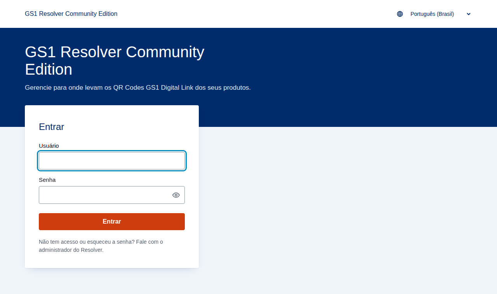

Abra o endereço do portal (por exemplo `https://id.example.org/portal/`), informe **Usuário** e **Senha** e
clique em **Entrar**. Se você não tem acesso ou esqueceu a senha, fale com o administrador do Resolver: o
portal não tem recuperação de senha por conta própria.

- **Senha temporária.** Uma conta nova, ou cuja senha foi redefinida por um administrador, começa com uma
  senha temporária. Depois de entrar, o portal pede que você defina a sua senha antes de continuar.
- **Mostrar a senha.** O botão com o olho dentro do campo de senha mostra o que foi digitado; a senha volta
  a ficar oculta quando o formulário é enviado.
- **Muitas tentativas.** Depois de 5 senhas erradas, a conta (e o computador de onde vieram) precisa
  esperar 15 minutos para tentar de novo.
- **Sessão.** Você continua conectado por 8 horas depois da última ação (o administrador pode mudar esse
  prazo). Quando a sessão termina, o portal pede para entrar de novo.
- **Idioma.** O menu de idioma, no alto à direita, troca entre Português (Brasil) e English (UK) na hora,
  sem perder o que foi digitado. O portal começa no idioma do navegador e lembra a sua escolha; as páginas
  do próprio Resolver e a página inicial seguem a mesma escolha.

### O menu do usuário

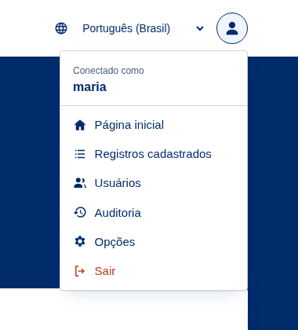

O botão redondo no alto à direita abre o menu do usuário: o seu nome, **Página inicial** (a página
inicial do Resolver), **Registros cadastrados** (seção 11), **Usuários** e **Auditoria** (só
administradores), **Opções** e **Sair**.

### Trocar a senha

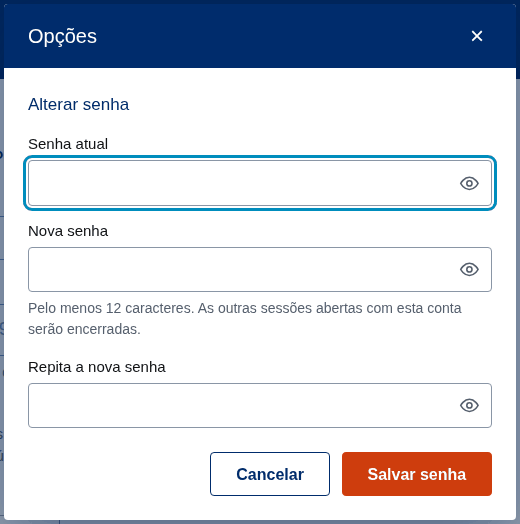

**Opções** abre o formulário de senha. Preencha a **Senha atual**, a **Nova senha** (pelo menos 12
caracteres) e **Repita a nova senha**, depois clique em **Salvar senha**. As outras sessões abertas com a
sua conta (outro navegador, outro computador) são encerradas; a sessão atual continua.

## 4. O editor em uma olhada

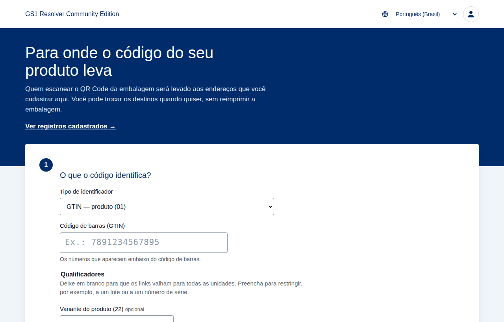

A página que abre depois de entrar é o **editor**. Ele tem três passos numerados e, embaixo deles, o
**bloco da etiqueta** com o QR Code:

1. **O que o código identifica?** — o tipo de identificador, o identificador e seus qualificadores, e o
   botão **Abrir cadastro**.
2. **Descrição** — como o item é chamado.
3. **Destinos** — para onde o código leva.

O link abaixo do título da página, *Ver registros cadastrados →*, abre a lista de registros.

## 5. Criar ou alterar um cadastro

Os mesmos passos criam um cadastro novo ou alteram um existente: o portal descobre qual é o caso quando
você abre o cadastro.

### Passo 1 — identificar o item

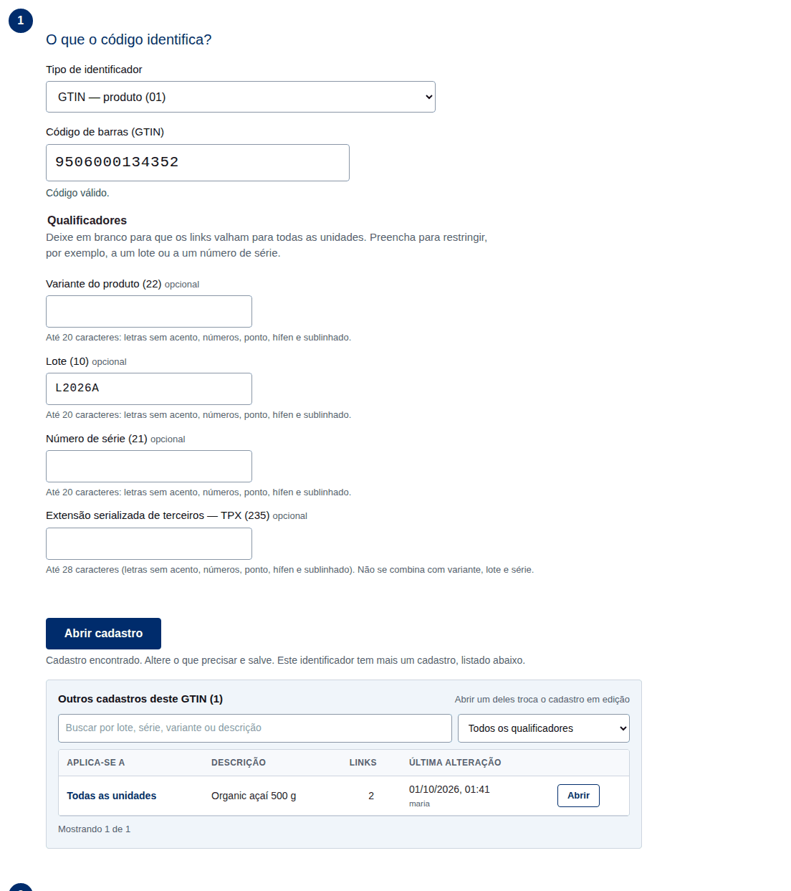

1. Escolha o **Tipo de identificador**. A lista tem todas as chaves primárias de identificação do GS1
   Digital Link: GTIN — produto, ITIP — parte de um produto, GMN — modelo de produto, CPID — componente ou
   peça, GLN — local físico, GLN — parte faturadora, GLN — empresa ou organização, GSRN — prestador e
   beneficiário de serviço, GCN — cupom, SSCC — unidade logística, GDTI — documento, GINC — consignação,
   GSIN — embarque, GRAI — ativo retornável e GIAI — ativo individual.
2. Digite o identificador. Para um GTIN, digite os números que aparecem embaixo do código de barras: 8,
   12, 13 ou 14 dígitos; espaços, pontos e hífens são ignorados e o portal completa o GTIN para 14
   dígitos. A mensagem embaixo do campo confere enquanto você digita: o tamanho, o dígito verificador (e
   qual deveria ser), os caracteres permitidos, o prefixo de empresa GS1 no início. Códigos que começam
   com 2 são de uso interno de loja e não podem ser publicados.
3. **Qualificadores** (só nos tipos que os têm). Deixe em branco para um cadastro que vale para todas as
   unidades do item. Preencha para restringir o cadastro, por exemplo a um lote ou a um número de série.
   Cada campo explica o seu formato. O portal só aceita as combinações que o padrão permite e diz o motivo
   quando recusa uma:

   | Identificador | Qualificadores |
   |---|---|
   | GTIN (01) | Variante do produto (22), Lote (10), Número de série (21) — qualquer um deles, nessa ordem (com número de série, variante e lote são informativos, veja abaixo); ou Extensão serializada de terceiros — TPX (235) sozinha |
   | ITIP (8006) | Lote (10), Número de série (21) (com número de série, o lote é informativo) |
   | CPID (8010) | Número de série do componente (8011) |
   | GLN (414) | Extensão do GLN (254), ou UIC com extensão e índice do importador (7040) |
   | GLN parte faturadora (415) | Referência de pagamento (8020), obrigatória |
   | GLN empresa (417), GIAI (8004) | UIC com extensão e índice do importador (7040) |
   | GSRN (8017, 8018) | Instância da relação de serviço (8019) |
   | GMN, GCN, SSCC, GDTI, GINC, GSIN, GRAI | nenhum |

   **Série com lote ou variante.** Digite tudo o que está impresso na embalagem: variante, lote e número
   de série. Com número de série, os campos de variante e lote ficam marcados como *informativo*, com borda
   tracejada. A norma GS1 (GS1-Conformant Resolver, seção 2.5.9) não deixa um cadastro de série depender
   do lote ou da variante, então o cadastro vale para a série; lote e variante ficam guardados nele — dá
   para buscar, filtrar e exportar por eles — e vão impressos no QR Code. Quem escanear outra unidade
   desse lote sem cadastro próprio vai para o cadastro do lote, se existir, e depois para o do produto.

   Abaixo dos qualificadores, o quadro **Este cadastro vale para** diz isso em linguagem simples, para
   qualquer combinação: *todas as unidades deste GTIN*, *Lote L1*, *Série S1*…

   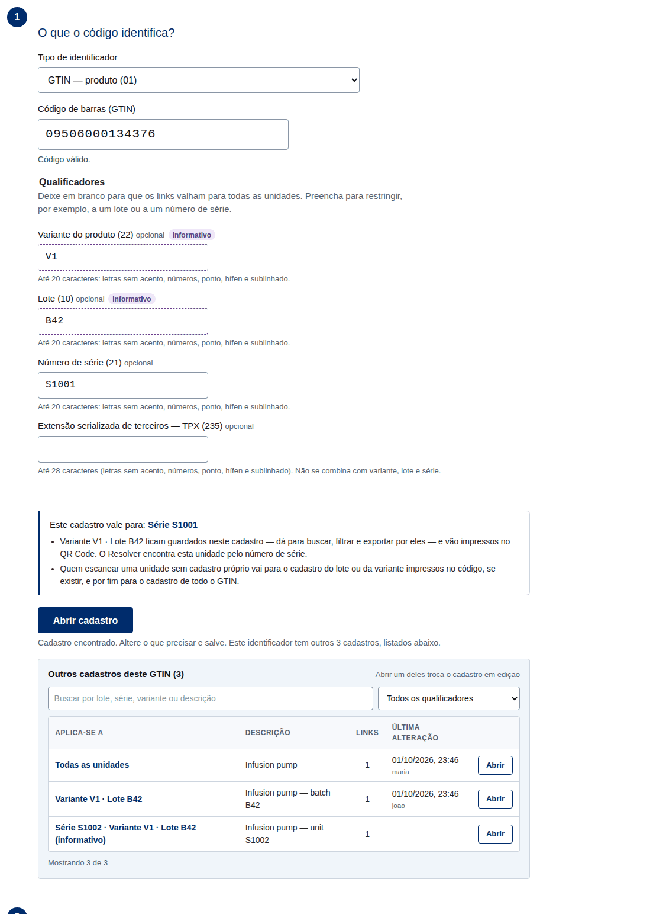

4. Clique em **Abrir cadastro**. O portal consulta o Resolver e responde:
   - *Cadastro encontrado. Altere o que precisar e salve.* — o cadastro existe; os passos 2 e 3 mostram o
     que está cadastrado;
   - *Ainda não há cadastro. Preencha os passos abaixo.* — um cadastro novo;
   - quando o identificador tem outros cadastros (o produto e alguns lotes, por exemplo), ele avisa e os
     lista embaixo do botão (seção 6).

Se você mudar o identificador ou um qualificador depois de abrir um cadastro, os passos 2 e 3 ficam
bloqueados e o portal pede para clicar de novo em **Abrir cadastro**. Assim você nunca sobrescreve outro
cadastro por engano. Se o cadastro tinha alterações não salvas, **Abrir cadastro** pergunta antes de
descartá-las. Mudar só o lote ou a variante informativos de uma série mantém o cadastro aberto.

Abrir uma série sem lote nem variante preenche os que estão guardados nela. Se você digitar outro lote, o
portal mantém o que você digitou e aponta a diferença: ao salvar, o lote guardado é substituído.

### Passo 2 — descrição

Digite como o item é chamado: *Seringa descartável 5 ml*, *Depósito — doca 3*, *Nota fiscal 2026-001*
(até 200 caracteres). A descrição aparece na lista de registros e nas páginas do Resolver.

### Passo 3 — destinos

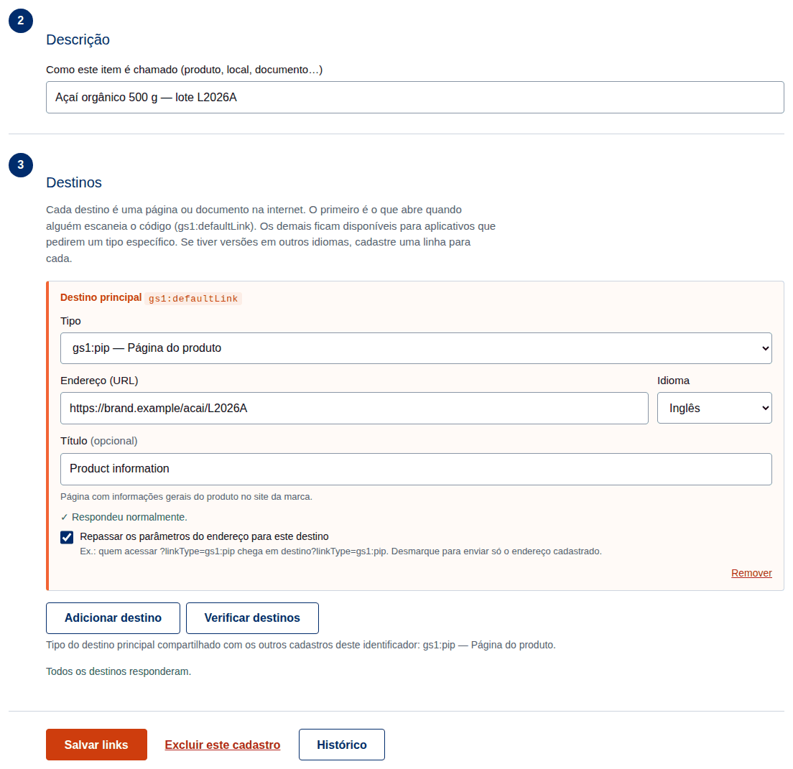

Cada destino é uma página ou um documento na internet. Para cada destino, preencha:

- **Tipo** — do que trata a página, entre os tipos de link GS1: Página do produto (`gs1:pip`), Instruções
  de uso, Atendimento (SAC), Informações de segurança, Bula eletrônica (paciente), Situação de
  recolhimento (recall), Informação nutricional, Rastreabilidade, Dados cadastrais (B2B) e outros (29 no
  total). O texto embaixo do campo explica o tipo escolhido.
- **Idioma** — o idioma da página (português, inglês, espanhol, francês, alemão, italiano, chinês,
  japonês). Dois destinos do mesmo tipo só são aceitos em idiomas diferentes: o Resolver então leva cada
  pessoa à versão no idioma do navegador dela. Quem usa um idioma sem versão recebe o destino principal (o
  primeiro).
- **Endereço (URL)** — o endereço completo, começando com `https://`. Copie-o da barra de endereços do
  navegador; espaços, quebras de linha e caracteres invisíveis são recusados.
- **Título** (opcional) — um nome curto mostrado nas listas de links.

O primeiro destino é o **destino principal** (selo *Destino principal*, `gs1:defaultLink`): é o que abre
quando alguém escaneia o código sem pedir nada específico. **Tornar principal** leva outro destino para o
topo; **Remover** apaga um destino; **Adicionar destino** inclui mais um (até 20 por cadastro).

> **Um tipo de destino principal por identificador.** Todos os cadastros do mesmo identificador (o
> produto, seus lotes, seus números de série) usam o mesmo *tipo* de destino principal, porque o Resolver
> guarda esse tipo uma vez por identificador. Quando há outros cadastros, o portal mostra esse tipo e pede
> para mantê-lo no primeiro destino.

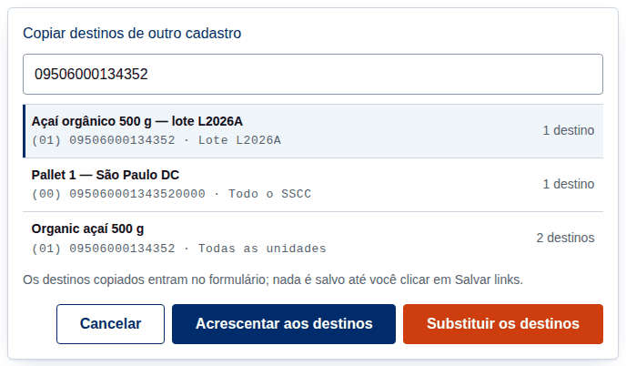

**Copiar destinos de…** abre uma busca em todos os cadastros: escolha um e clique em **Acrescentar aos
destinos** (depois dos que estão no formulário) ou **Substituir os destinos**. Nada é salvo até você clicar
em **Salvar links**.

**Verificar destinos** pergunta a cada endereço se ele responde (seção 13); isso nunca impede de salvar.

### Salvar

Clique em **Salvar links**. O portal confere tudo de novo no servidor e responde:

- *Cadastro criado. O código já leva aos destinos informados.*
- *Alterações salvas. O código já leva aos novos destinos.*

**Um cadastro acima.** A norma GS1 pede que qualquer código, por mais detalhado, encontre um destino
padrão no seu nível ou acima. Ao salvar um lote, uma série ou uma extensão de um identificador que não tem
cadastro próprio, o portal pergunta antes:

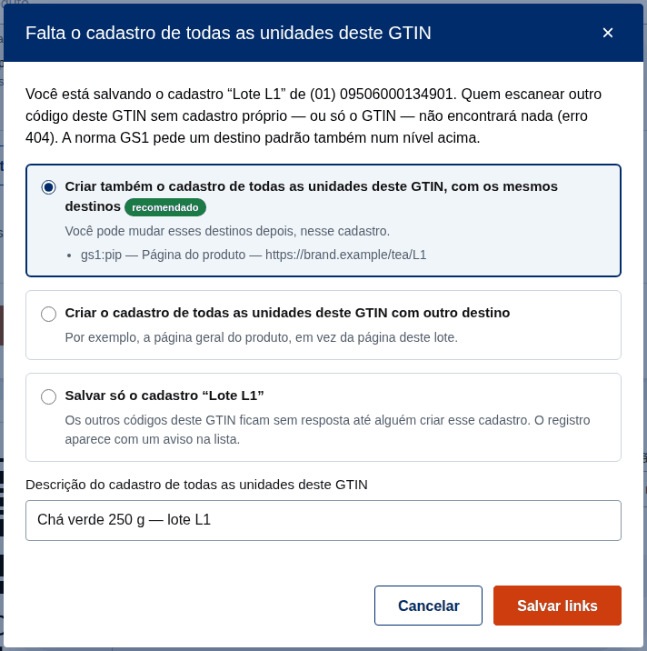

- **Criar também o cadastro de todas as unidades deste GTIN, com os mesmos destinos** — *recomendado*, e
  já escolhido. Você pode mudar esses destinos depois, nesse cadastro;
- **Criar o cadastro com outro destino** — por exemplo, a página geral do produto em vez da página do
  lote; tipo e idioma são os do seu destino principal;
- **Salvar só este cadastro** — os outros lotes e séries do identificador ficam sem resposta (erro 404)
  até alguém criar esse cadastro, e a lista de registros o sinaliza.

A descrição do novo cadastro pode ser mudada na mesma janela. **Cancelar** não salva nada. Identificadores
que não existem sem qualificador (GLN de quem fatura, com a referência de pagamento) não entram nessa
pergunta.

Depois de salvar, o portal também confere se os destinos respondem e avisa embaixo de qualquer um que não
responda (seção 13); o cadastro fica salvo de qualquer jeito. Se algo estiver errado, a mensagem diz o quê e
onde (por exemplo *Preencha o endereço (URL) do destino
2.*). O bloco da etiqueta mostra **Publicado** quando o cadastro existe no Resolver.

## 6. Outros cadastros do mesmo identificador

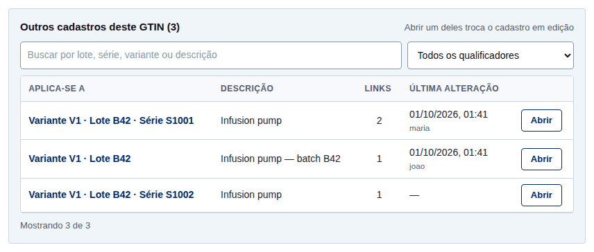

Quando o identificador tem outros cadastros — o próprio produto, seus lotes, seus números de série, suas
variantes —, um quadro embaixo de **Abrir cadastro** os lista: *Outros cadastros deste GTIN (3)*. Para cada
um ele mostra a que se aplica (*Todas as unidades*, *Lote L2026-03 · Série S0001*), a descrição, o número
de links e a última alteração feita pelo portal.

- Digite no campo de busca para achar um lote, série, variante ou descrição.
- Use o filtro para ver só os cadastros com um certo qualificador, ou *Sem qualificadores (todas as
  unidades)*.
- Cinco linhas ficam à vista; role a lista para ver mais.
- **Abrir** carrega aquele cadastro no editor. Se o cadastro em edição tiver alterações não salvas, o
  portal pergunta antes: *Há alterações não salvas neste cadastro. Abrir outro vai descartá-las. Deseja
  continuar?*

Cadastros criados em outras ferramentas com qualificadores que o portal não edita (como um modelo de lote
`{lotnumber}`) aparecem na lista, mas não podem ser abertos; altere-os pela API.

## 7. Excluir um cadastro

**Excluir este cadastro** (aparece em cadastros existentes, para editores e administradores) pede
confirmação e remove **só o cadastro em edição**: excluir um lote mantém o produto e os outros lotes;
excluir o cadastro sem qualificadores mantém os lotes e os números de série. Depois disso o código deixa
de levar àqueles destinos — a leitura de um lote passa a usar os destinos do produto, se o produto tiver
cadastro.

A exclusão fica no histórico e na auditoria, e o cadastro pode ser recriado a partir dali.

## 8. Histórico de um cadastro

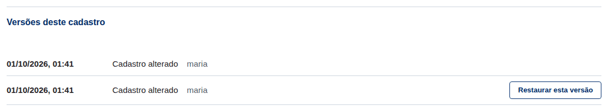

**Histórico** (embaixo dos passos) lista as versões do cadastro salvas pelo portal, da mais recente para a
mais antiga: quando, o quê (*Cadastro criado*, *Cadastro alterado*, *Cadastro excluído*, *Importação de
planilha*) e quem.

**Restaurar esta versão** (editores e administradores; aparece em todas as versões menos a atual, e numa
exclusão) traz a descrição e os destinos daquela versão para o formulário. Nada muda no Resolver até você
conferir o formulário e clicar em **Salvar links**; um cadastro excluído é recriado do mesmo jeito.

Alterações feitas diretamente pela API, fora do portal, não aparecem nesse histórico.

## 9. A etiqueta com o QR Code

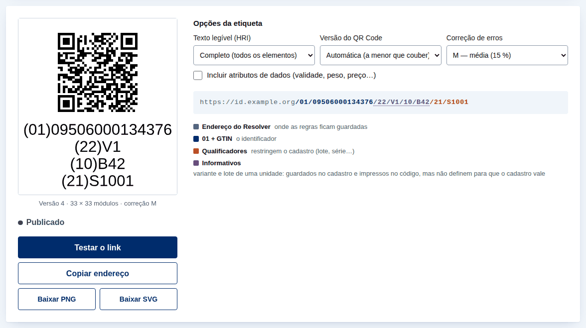

O bloco da etiqueta mostra o QR Code do cadastro enquanto você digita, o GS1 Digital Link que ele carrega
(colorido por parte: endereço do Resolver, identificador, qualificadores, atributos de dados) e uma
legenda.

- **Publicado** / **Ainda não cadastrado** indica se o cadastro existe no Resolver.
- **Testar o link** abre o Digital Link numa nova aba, como uma leitura faria.
- **Copiar endereço** copia o Digital Link.
- **Baixar PNG** e **Baixar SVG** salvam a etiqueta. O SVG é desenhado em milímetros no tamanho de módulo
  recomendado (X = 0,495 mm), com zona de silêncio de 4 módulos e texto de 2,2 mm de altura; impresso a
  100 %, sai no tamanho certo. Use o SVG na arte de impressão e o PNG em telas e documentos.

**Opções da etiqueta**

- **Texto legível (HRI)** — *Completo (todos os elementos)*: o identificador e cada qualificador numa
  linha, como na imagem; *Só a chave de identificação*; *Nenhum*.
- **Versão do QR Code** — *Automática (a menor que couber)*, ou uma versão fixa de 1 (21 × 21 módulos) a
  40 (177 × 177), quando a arte precisa de um tamanho constante.
- **Correção de erros** — L (7 %), M (15 %, o padrão), Q (25 %) ou H (30 %): quanto do código pode estar
  danificado e ainda ser lido. O nível é aplicado exatamente como escolhido.

Embaixo do código o portal mostra a versão, o tamanho e a correção realmente usados, por exemplo
*Versão 4 · 33 × 33 módulos · correção M*. Quando o conteúdo não cabe na versão escolhida, o código é
substituído por uma explicação e pelas saídas: uma versão maior, *Automática*, uma correção menor ou um
conteúdo mais curto.

## 10. Atributos de dados no QR Code

*(Disponível quando a instalação inclui o GS1 Barcode Syntax Engine; sem ele, a opção não aparece.)*

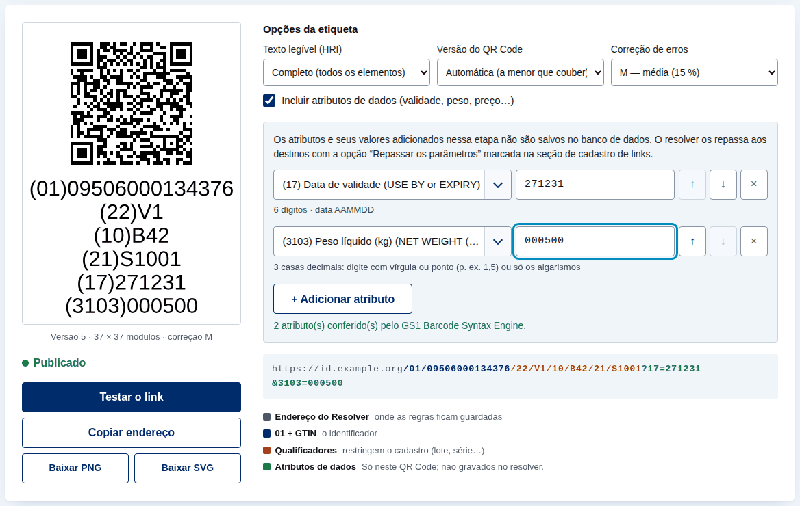

Atributos de dados acrescentam informações que não fazem parte da identificação — validade, peso
líquido, preço… — ao QR Code que está sendo gerado, por exemplo
`https://id.example.org/01/09506000134376/22/V1/10/B42/21/S1001?17=271231&3103=000500`.

1. Marque **Incluir atributos de dados (validade, peso, preço…)**.
2. Em **Atributo (AI)**, escolha na lista (*Mais usados* primeiro, depois *Todos os atributos*) ou digite
   um número ou parte do nome (`17`, `validade`, `peso`). Cada atributo mostra o formato do seu valor.
3. Digite o **Valor do atributo**. Datas são AAMMDD; o dia 00 (“fim do mês”) é recusado e o portal sugere
   o primeiro ou o último dia do mês. Medidas e valores cujo número de casas decimais faz parte do código
   aparecem como famílias — (310n) peso líquido em kg, (392n) preço… — e aceitam o número como você
   escreve, com vírgula ou ponto: `123,45` entra no código como `3102=012345`. A linha *→ Na URI: …*
   mostra exatamente o que será codificado.
4. **+ Adicionar atributo** inclui outro; as setas mudam a ordem; **×** remove um.

O GS1 Barcode Syntax Engine confere cada atributo e a combinação (alguns atributos exigem outros, alguns
não podem aparecer juntos), e o portal explica qualquer recusa. Um qualificador do cadastro (lote, série,
variante) nunca é atributo: abra ou crie o cadastro com esse qualificador.

> **Os atributos não são salvos.** Eles vão só para o QR Code gerado agora e seus downloads, e são limpos
> quando outro cadastro é aberto. O Resolver os repassa ao destino, como faz com qualquer parâmetro do
> endereço lido.

## 11. Registros cadastrados: busca e filtros

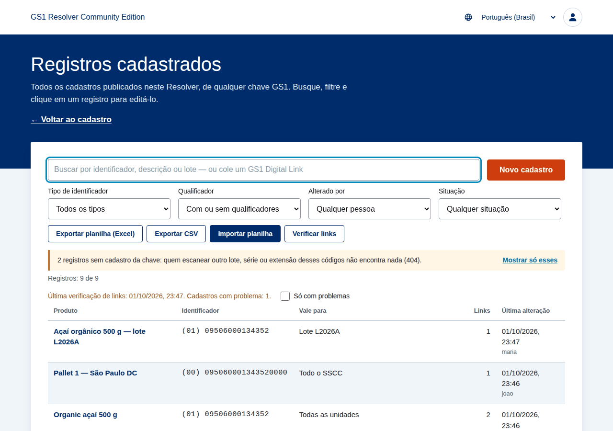

**Registros cadastrados** (menu do usuário, ou *Ver registros cadastrados →*) lista todos os cadastros que
você pode ver, os alterados mais recentemente primeiro: produto (descrição), identificador, a que se
aplica, número de links (com um aviso quando a última verificação de links encontrou problemas) e a
última alteração feita pelo portal (data e usuário; *sem histórico* para cadastros feitos fora dele).
Clique numa descrição para abrir o cadastro no editor; o botão voltar do navegador retorna à lista.

### Busca por texto

Digite no campo de busca: um identificador (um GTIN com ou sem os zeros à esquerda), o nome de uma chave
(GTIN, SSCC, GLN…), uma descrição, um lote ou uma série. Várias palavras restringem o resultado;
maiúsculas e acentos são ignorados (*acai* encontra *Açaí*).

### Filtros

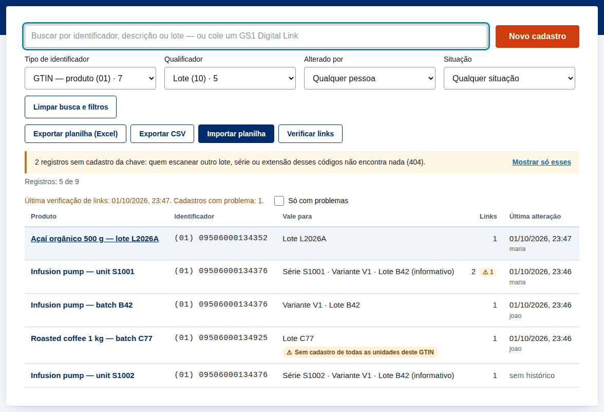

- **Tipo de identificador** — só os cadastros de um tipo de chave primária. A lista mostra apenas os tipos
  presentes, com quantos cadastros cada um tem (*GTIN — produto (01) · 6*).
- **Qualificador** — só os cadastros que têm um certo qualificador, sozinho, com outros ou como informação
  (uma série com lote informativo aparece em *Lote*); *Nenhum (vale para o identificador inteiro)* para os cadastros
  sem qualificadores; *Outros (criados fora do portal)* para conjuntos de qualificadores que o portal não
  edita. As opções acompanham o tipo de identificador escolhido.
- **Alterado por** — só os cadastros alterados por último por um usuário.
- **Situação** — cadastros que pedem atenção: *Sem cadastro da chave* (um lote, uma série ou uma extensão
  cujo identificador não tem cadastro próprio, de modo que os outros códigos dele respondem 404) e *Série
  com lote ou variante no cadastro* (feitos antes de a regra GS1 ser aplicada). Um selo marca cada um na
  lista, e um alerta acima dela oferece **Mostrar só esses** enquanto houver cadastros sem o da chave.

  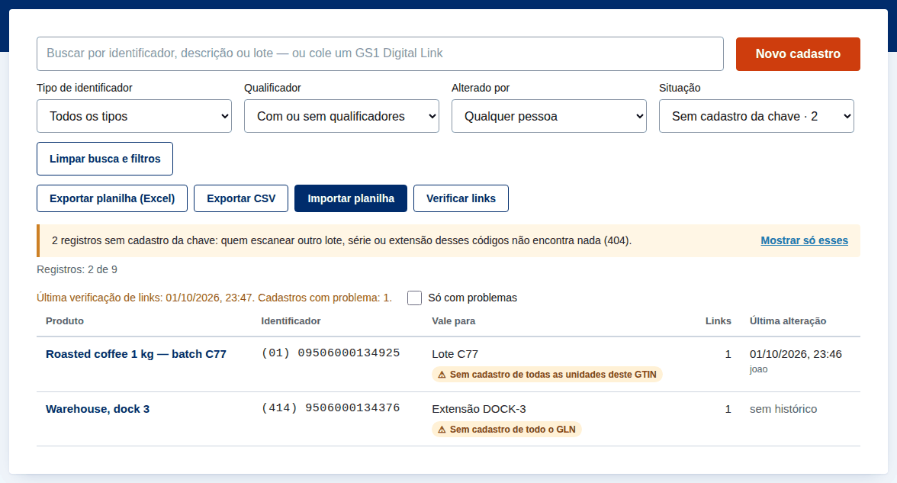
- **Só com problemas** — depois de uma verificação de links, só os cadastros com destinos com problema.

**Limpar busca e filtros** aparece enquanto algum deles está em uso. A linha de contagem mostra quantos
cadastros aparecem do total (*Registros: 4 de 9*).

### Achar um código: colar um Digital Link ou uma element string

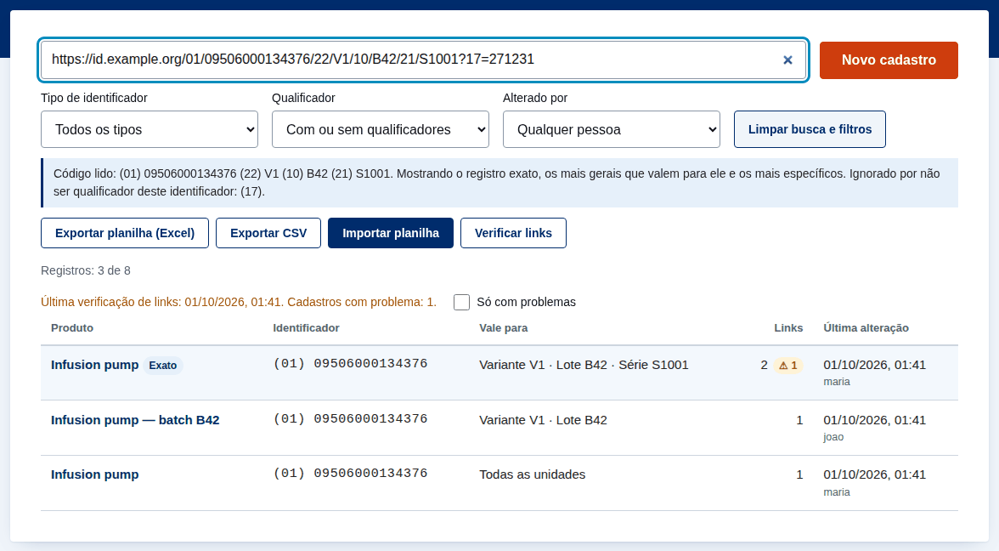

Cole um GS1 Digital Link (de qualquer domínio — um QR Code lido, um link de um documento) ou digite uma
element string com os AIs entre parênteses, como `(01)09506000134376(10)B42`, e a lista mostra os
cadastros relacionados a esse código:

1. o cadastro **exato** (selo **Exato**): mesmo identificador e mesmos qualificadores;
2. os cadastros mais gerais que valem para ele — o lote, a variante, o produto;
3. os mais específicos — para um lote, os seus números de série.

Outros lotes, variantes e números de série ficam de fora. Uma linha embaixo dos filtros mostra o código
lido e indica as partes que não são qualificadores daquele identificador (atributos de dados como o
(17)), ignoradas porque nunca são gravadas. Um GTIN de 8, 12 ou 13 dígitos é completado para 14. Um
Digital Link só do identificador lista todos os cadastros dele.

## 12. Planilhas: exportar e importar

### Exportar

**Exportar planilha (Excel)** ou **Exportar CSV** baixa todos os cadastros que você pode ver, uma linha por
destino, com os títulos das colunas no seu idioma:

| Coluna | Conteúdo |
|---|---|
| Chave (AI) | a chave primária: 01, 414, 00… |
| Identificador | o identificador (GTIN com 14 dígitos) |
| Qualificadores | vazio para o identificador inteiro; senão `(10)L1(21)S1` |
| Descrição | a descrição do cadastro |
| Tipo de link | `gs1:pip`, `gs1:instructions`… |
| URL | o endereço do destino |
| Idioma | `pt`, `en`, `pt-BR`… |
| Título | o título do destino |
| Principal | *sim* no destino principal do cadastro |
| Repassar parâmetros | *sim* ou *não* |

O arquivo Excel também tem abas de referência: **Tipos de link** (código, nome, descrição), **Chaves** e
**Idiomas**. Células que poderiam ser lidas como fórmulas são protegidas, então o arquivo é seguro para
abrir.

### Importar

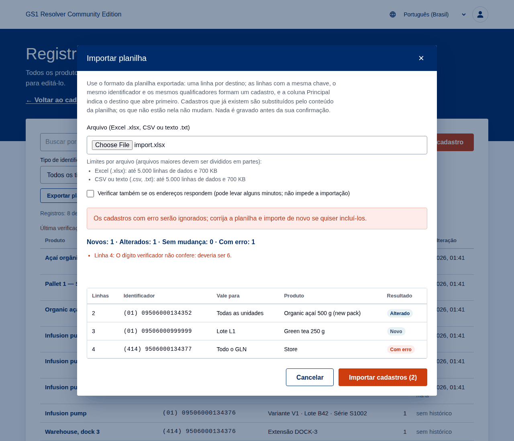

Use a planilha exportada como modelo. Linhas com a mesma chave, o mesmo identificador e os mesmos
qualificadores formam um cadastro; a coluna **Principal** indica o destino que abre primeiro.

1. **Importar planilha** (editores e administradores) abre a janela. Escolha o arquivo: Excel (.xlsx), CSV
   ou texto (.csv, .txt). A janela mostra os limites por arquivo (5.000 linhas de dados e 700 KB para
   cada formato); divida arquivos maiores.
2. Se quiser, marque **Verificar também se os endereços respondem** (seção 13).
3. O portal confere cada linha com as regras do editor e mostra uma **prévia** — *Novos*, *Alterados*,
   *Sem mudança*, *Com erro* — e, para cada linha errada, o número da linha e o motivo (um identificador
   inválido, um endereço sem `https://`, um idioma desconhecido, dois destinos principais…). Nada foi
   gravado ainda.
4. **Importar cadastros (n)** grava os cadastros válidos; os que têm erro são ignorados. Corrija a planilha
   e importe de novo para incluí-los.

Uma série é escrita como na etiqueta — `(22)V1(10)B42(21)S1` — e importada do mesmo jeito: o cadastro é o
da série, e variante e lote ficam guardados nele como informação. Quando uma importação muda o lote de uma
série que já existe, a prévia mostra o lote que ela tinha (*antes: …*).

Quando a planilha deixaria um identificador só com lotes ou séries, sem cadastro próprio, a prévia lista
esses identificadores e oferece **Criar também o cadastro de cada um, com os destinos da primeira linha
dele na planilha** (marcado). Desmarque para importar só as linhas da planilha.

A importação nunca exclui nada: cadastros que não estão no arquivo continuam como estão. Ela fica
registrada no histórico de cada cadastro e na auditoria.

**Dicas para o Excel.** Formate a coluna Identificador como *Texto* antes de digitar; senão o Excel
transforma códigos longos em notação científica (o portal percebe e avisa). Arquivos CSV salvos pelo Excel
em português (separador “;”, codificação do Windows) e arquivos “Texto Unicode” são reconhecidos.

## 13. Verificar se os destinos respondem

O verificador de links pergunta a cada endereço se ele responde, sem mudar nada:

- **No editor** — automaticamente depois de cada salvamento, e quando você quiser com **Verificar
  destinos**: os destinos do formulário são conferidos e o resultado aparece embaixo de cada um
  (*✓ Respondeu normalmente.* ou o problema).
- **Todos os cadastros** — **Verificar links** na lista de registros confere todos os destinos em segundo
  plano; o resumo (*Última verificação de links: … Cadastros com problema: 2.*) fica até a próxima
  verificação, um aviso marca cada cadastro com problema e **Só com problemas** os filtra. Abrir um desses
  cadastros confere os destinos dele de novo.
- **Prévia da importação** — a opção na janela de importação.

Problemas apontados: uma resposta de erro (404, 500…), um site que recusa verificação automática (abra o
endereço no navegador para conferir), um site que não responde, um redirecionamento para página sem
HTTPS, mais de 5 redirecionamentos, um endereço de rede interna (nunca contatado) ou um endereço inválido.
Alguns sites respondem “página não encontrada” com uma página normal; esses o verificador não consegue
detectar.

## 14. Administração: usuários

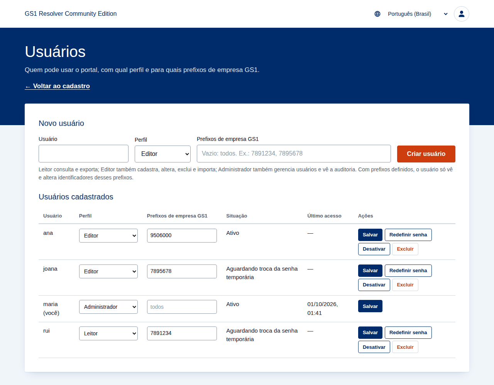

**Usuários** (menu do usuário, administradores) define quem pode usar o portal.

**Criar um usuário.** Informe o **Usuário** (de 3 a 64 letras, números, `.`, `-`, `_` ou `@`), escolha o
**Perfil** e, se quiser, os **Prefixos de empresa GS1** (de 4 a 12 dígitos cada, separados por vírgula;
vazio significa todos os identificadores) e clique em **Criar usuário**. O portal mostra uma **senha
temporária uma única vez**: copie-a (**Copiar senha**) e envie por um canal seguro. O usuário deverá
trocá-la no primeiro acesso.

**Usuários cadastrados** lista cada usuário com perfil, prefixos, situação (*Ativo*, *Desativado*,
*Aguardando troca da senha temporária*) e último acesso. Para cada um:

- mude o perfil ou os prefixos e clique em **Salvar**;
- **Redefinir senha** — uma nova senha temporária, mostrada uma vez; as sessões abertas do usuário são
  encerradas;
- **Desativar** / **Reativar** — um usuário desativado não consegue entrar, e a conta é mantida;
- **Excluir** — apaga a conta; as alterações do usuário continuam no histórico e na auditoria.

Você não pode desativar, rebaixar ou excluir o seu próprio usuário, e o portal sempre mantém pelo menos um
administrador ativo. Usuários criados antes de existirem perfis são administradores.

## 15. Administração: auditoria

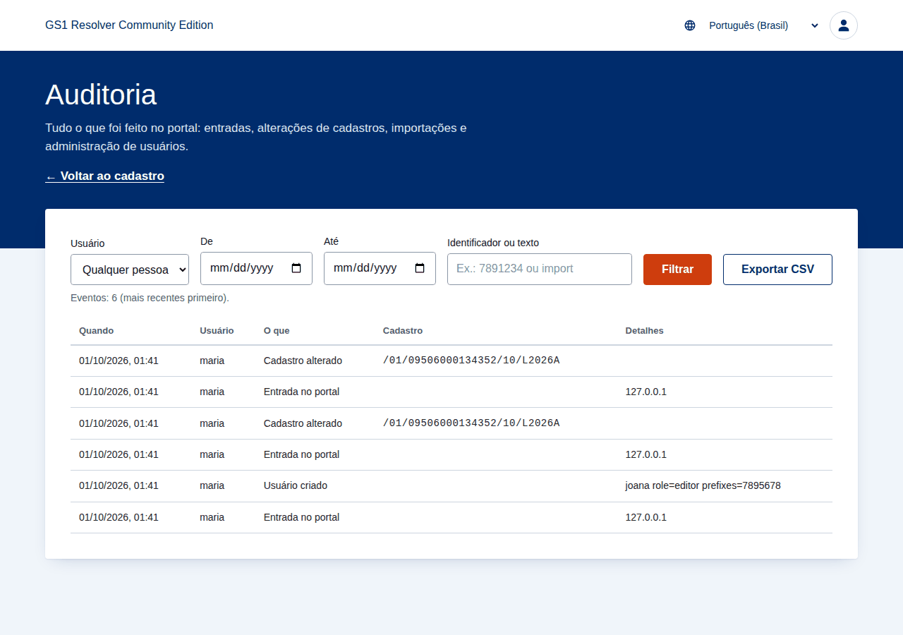

**Auditoria** (menu do usuário, administradores) lista tudo o que foi feito no portal, do mais recente
para o mais antigo: entradas (e tentativas recusadas), saídas, trocas de senha, cadastros criados,
alterados e excluídos, importações, exportações e administração de usuários.

Filtre por **Usuário**, por data (**De**, **Até**) e por **Identificador ou texto** (um GTIN, um prefixo,
*import*…) e clique em **Filtrar**. **Exportar CSV** baixa os mesmos eventos para o Excel. Um
administrador limitado a alguns prefixos de empresa GS1 vê só os eventos de cadastros desses prefixos.

## 16. Mensagens e o que fazer

| Mensagem | O que fazer |
|---|---|
| *O dígito verificador não confere: deveria ser N.* | Confira os números digitados; o último dígito é calculado a partir dos outros. |
| *O identificador deve começar pelo prefixo de empresa GS1…* | Chaves alfanuméricas (GMN, CPID, GINC, GIAI) começam com os dígitos do prefixo da empresa. |
| *O padrão não permite esta combinação de qualificadores…* | Use uma das combinações da seção 5 (por exemplo TPX sozinho, ou 7040 sem 254). |
| *Você mudou o código. Clique em Abrir cadastro para ver os destinos dele.* | Clique em **Abrir cadastro**; os passos 2 e 3 são liberados. |
| *Este identificador tem outros cadastros (…) que abrem primeiro em …* | Mantenha o tipo principal compartilhado no primeiro destino (seção 5). |
| *Os destinos N e M têm o mesmo tipo e idioma.* | Troque o idioma de um deles ou remova um. |
| *Este identificador não pertence aos prefixos de empresa GS1 do seu usuário.* | Peça a um administrador para incluir o prefixo no seu usuário. |
| *Seu perfil não permite esta ação.* | Peça a um administrador o perfil de editor. |
| *O conteúdo não cabe na versão N com correção L.* | Escolha uma versão maior ou *Automática*, uma correção menor ou menos atributos. |
| *O Resolver não respondeu.* | Tente de novo em alguns minutos; se continuar, avise o administrador. |
| *Sua sessão terminou. Entre novamente.* | Entre de novo; alterações não salvas no formulário se perdem. |
| *Muitas tentativas sem sucesso. Tente de novo em N minuto(s).* | Aguarde, ou peça a um administrador para redefinir a sua senha. |

## 17. Glossário

- **AI (Application Identifier, identificador de aplicação)** — o número entre parênteses que diz o que é
  um valor: (01) GTIN, (10) lote, (17) validade…
- **Atributo de dados** — informação extra na parte de parâmetros de um Digital Link (validade, peso,
  preço); nunca gravada pelo Resolver.
- **Cadastro** — um identificador com seus qualificadores, descrição e destinos.
- **Chave primária de identificação** — o identificador principal: GTIN, GLN, SSCC, GRAI…
- **Destino** — uma página ou documento na internet cadastrado para um cadastro.
- **Destino principal** — o destino que abre quando o código é escaneado sem pedir um tipo específico.
- **Element string** — a forma com parênteses impressa embaixo dos códigos de barras:
  `(01)09506000134352(10)L2026A`.
- **GS1 Digital Link** — um endereço da web que carrega chaves de identificação GS1.
- **HRI (human readable interpretation)** — o texto impresso junto ao código.
- **Prefixo de empresa GS1** — os primeiros dígitos de um identificador, atribuídos pela GS1 a uma empresa.
- **Qualificador** — um valor que restringe uma chave: variante, lote, número de série, extensão do GLN…
- **Resolver** — o serviço que responde aos GS1 Digital Links e leva as pessoas aos destinos cadastrados.
- **Tipo de link** — do que trata um destino, segundo o vocabulário web da GS1 (`gs1:pip`,
  `gs1:instructions`…).
